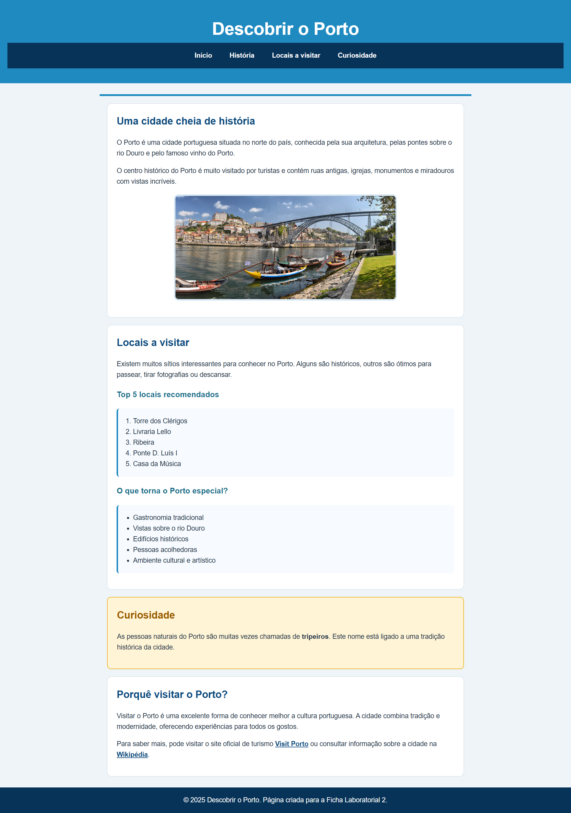

# Ficha Laboratorial 2: HTML Semântico e CSS

## Objetivos

No final desta aula deverá ser capaz de:

- Utilizar elementos HTML semânticos para estruturar conteúdos.
- Organizar uma página Web em secções lógicas.
- Aplicar estilos CSS a diferentes elementos HTML.
- Compreender o modelo básico de caixas (*box model*).
- Utilizar classes e seletores CSS.
- Melhorar a aparência visual de uma página Web.

_Pode ver no final da ficha uma screenshot exemplificativo de um possível resultado final_

---

# Preparação

Crie os seguintes ficheiros:

```text
Ficha-Lab-02/
│
├── index.html
├── style.css
└── images/
```

---

# 1. Estruturar uma Página com HTML Semântico

Crie uma página sobre um tema à sua escolha.

Por exemplo:

- uma banda musical;
- um clube desportivo;
- uma cidade;
- um videojogo;
- um hobby.

A página deverá utilizar os seguintes elementos semânticos:

```html
<header>
<nav>
<main>
<section>
<article>
<footer>
```

### Estrutura sugerida

```text
+------------------+
| Header           |
+------------------+
| Navigation       |
+------------------+
| Main             |
|  |- Section 1    |
|  |- Section 2    |
|  |- Article      |
+------------------+
| Footer           |
+------------------+
```

### Exercício

Adicione:

- um título principal;
- um menu de navegação;
- duas secções de conteúdo;
- um artigo;
- um rodapé.

---

# 2. Adicionar Conteúdo

Inclua na página:

- pelo menos três títulos (`h1`, `h2`, `h3`);
- vários parágrafos;
- uma imagem;
- uma lista ordenada;
- uma lista não ordenada;
- pelo menos duas hiperligações.

---

# 3. Aplicar CSS

Associe o ficheiro `style.css`.

Adicione estilos para:

- cor de fundo da página;
- fonte utilizada;
- cor dos títulos;
- largura máxima do conteúdo;
- alinhamento do texto.

Exemplo:

```css
body {
    font-family: Arial, sans-serif;
}
```

Experimente diferentes estilos.

---

# 4. Seletores CSS

Crie regras CSS utilizando:

### Seletor por elemento

```css
h1 {
    color: darkblue;
}
```

### Seletor por classe

```css
.destaque {
    background-color: yellow;
}
```

### Seletor por identificador

```css
#principal {
    border: 1px solid black;
}
```

### Exercício

Aplique pelo menos:

- uma classe;
- um identificador;
- três seletores de elemento.

---

# 5. O Modelo de Caixa (Box Model)

Todos os elementos HTML são representados pelo navegador como caixas.

Adicione aos elementos:

```css
padding
margin
border
```

Exemplo:

```css
section {
    padding: 20px;
    margin: 10px;
    border: 1px solid gray;
}
```

### Exercício

Experimente diferentes valores para:

- margem;
- espaçamento interno;
- espessura das bordas.

Observe as diferenças.

---

# 6. Estilizar a Navegação

Transforme a secção de navegação num menu horizontal.

Sugestão:

```css
nav ul {
    list-style: none;
}
```

### Desafio

Remova os marcadores da lista e torne os links mais apelativos.

---

# 7. Cartão de Destaque

Crie uma secção especial para destacar uma informação importante.

Exemplo:

```text
+----------------------+
| Curiosidade          |
|                      |
| Texto de destaque... |
+----------------------+
```

Utilize:

- fundo diferente;
- borda;
- cantos arredondados.

Exemplo:

```css
border-radius: 10px;
```

---

# 8. Validação e Inspeção

Utilize as Developer Tools do navegador para:

- inspecionar elementos;
- verificar regras CSS aplicadas;
- identificar propriedades herdadas.

### Exercício

Altere temporariamente:

- a cor de um título;
- a margem de uma secção;
- o tamanho de uma imagem.

---

# Desafio Final

Melhore a página de forma criativa adicionando:

- mais secções;
- imagens adicionais;
- ícones ou símbolos;
- estilos personalizados.

O objetivo é produzir uma página visualmente agradável e semanticamente organizada.

---

# Resultado final

No final da aula deverá existir:

```text
Ficha-Lab-02/
│
├── index.html
├── style.css
└── images/
```

A página deverá:

- utilizar elementos HTML semânticos;
- incluir conteúdo estruturado;
- possuir estilos CSS próprios;
- apresentar uma navegação funcional.

Screenshot exemplo:


---

# Questões de Reflexão

1. Qual a vantagem de utilizar elementos semânticos em vez de apenas `<div>`?
2. Qual a diferença entre uma classe e um identificador?
3. Qual a diferença entre `margin` e `padding`?
4. Porque é importante separar conteúdo e apresentação?
5. Como podem as Developer Tools ajudar durante o desenvolvimento Web?

---

# Objetivo da Ficha

Aprender a estruturar páginas Web utilizando HTML semântico e melhorar a sua apresentação através de CSS, criando conteúdos mais organizados, legíveis e fáceis de manter.


---
---
# Exercícios Extra
---
---


## Ex 1

Crie um novo documento HTML e copie o código seguinte para o corpo do documento. Associe uma folha de estilos CSS e, sem modificar o HTML, aplique um estilo ao elemento <span> de forma a conseguir o resultado da Figura 1.

```html
<p>There is a very <span>important</span> word in this sentence</p>
```

---

Figura 1
___ 

## Ex 2
Crie um novo documento HTML e copie o código seguinte para o corpo do documento. Associe uma folha de estilos CSS e, sem modificar o HTML, aplique um estilo de forma a colocar a primeira frase a bold.

```html
<div id="first">
	<p>First sentence.</p>
</div>
<div>
	<p>Second sentence.</p>
</div>
```

---

Figura 2
___ 


## Ex 3
Crie um novo documento HTML e copie o código seguinte para o corpo do documento. Associe uma folha de estilos CSS. 
- Aplique estilos CSS para emular o resultado da Figura 3.
   - Note que o HTML já tem classes associadas aos parágrafos.
- Pense sobre qual o melhor selector CSS para garantir flexibilidade do código.

```html
<p class="note">Note: Lorem ipsum dolor sit amet, consectetur adipiscing elit...</p>

<p class="warning">Warning: Etiam ultricies varius justo, sit amet elementum ligula commodo...</p>

<p class="error">Error: Nam vel aliquet dolor. In est tellus, gravida condimentum est ut, gravida finibus urna...</p>

<p>Etiam urna turpis, imperdiet at ante et, iaculis porta nisl... </p>

<p>Curabitur venenatis facilisis erat id convallis... </p>
```

---

Figura 3
___ 

## Ex 4
Menus horizontais podem ser criados de muitas formas. Neste exercício usamos uma técnica que consiste numa sequência de elementos `<span>` distribuídos horizontalmente.

Tente atingir o resultado da Figura 4. 
- Crie um novo documento HTML e copie o código seguinte para o corpo do documento.
- Associe uma folha de estilos CSS e copie o CSS seguinte para o documento.
- Parte do trabalho está feito no CSS. Implemente o resto do código CSS (cores de fundo, reagir ao “hover” e “active” pseudo-classes, centrar o texto, etc. Pode precisar das seguintes propriedades CSS:
  - `line-height`
  - `text-decoration`
  - `font-size`
  - `color`
- A reacção ao _hover_ e _active_ deve ser a alteração da cor de fundo.
  
HTML:
```html
<nav>
  <span><a href="#">Home</a></span><span><a href="#">Products</a></span><span><a hreF="#">Pricing</a></span><span><a href="#">Help</a></span>
</nav>
```
**Nota: Neste exercício, é importante manter o HTML tal como é apresentado acima. Não introduza espaços entre os elementos.**

CSS:
```css
nav>span {
   display: inline-block;
   width: 20%;

   margin-right: calc(20% / 3);
}
nav>span:last-child {
   margin-right: 0;
}
```

---

____