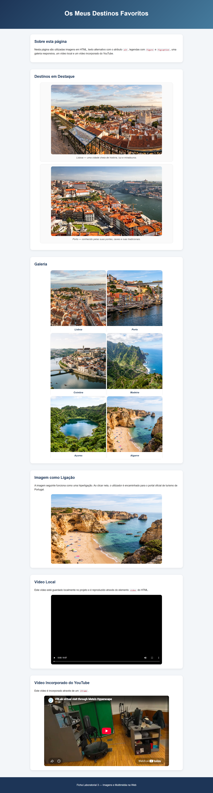

# Ficha Laboratorial 3: Imagens e Multimédia na Web

## Objetivos

No final desta aula deverá ser capaz de:

- Inserir imagens numa página Web.
- Utilizar texto alternativo (*alternative text*).
- Compreender a diferença entre formatos de imagem comuns.
- Controlar a apresentação de imagens com CSS.
- Incorporar conteúdo multimédia.
- Utilizar elementos HTML apropriados para figuras e legendas.
- Criar uma galeria simples de imagens.


_Pode ver no final da ficha uma screenshot exemplificativo de um possível resultado final_

---

# Preparação

Crie uma pasta para a ficha:

```text
Ficha-Lab-03/
│
├── index.html
├── style.css
└── images/
```

Guarde na pasta `images` algumas imagens à sua escolha.

Ao longo desta ficha irá criar uma página intitulada:

```text
Os Meus Destinos Favoritos
```

A página deverá apresentar alguns locais que gostaria de visitar (ou que já visitou), utilizando imagens, legendas e conteúdos multimédia.

No final da aula terá produzido uma pequena galeria multimédia completamente funcional.

---

# 1. Primeira Imagem

Crie a página:

```text
Os Meus Destinos Favoritos
```

__Nota:__ O ficheiro HTML para esta página deve chamar-se `index.html`.

Adicione:

- um cabeçalho;
- um pequeno texto introdutório;
- uma primeira imagem relativa a um dos destinos.

Exemplo:

```html

```

Utilize também um atributo `alt` adequado. 

## Questão

Porque é importante utilizar o atributo `alt`?

---

# 2. Destinos e Legendas

Adicione mais uma imagem.

Utilize os elementos:

```html
<figure>
    

    <figcaption>
        Nome do destino e pequena descrição.
    </figcaption>
</figure>
```

Cada destino deverá apresentar:

- imagem;
- nome do local;
- legenda descritiva.

---

# 3. Dimensionamento com CSS

Crie estilos para as imagens.

Exemplo:

```css
img {
    width: 300px;
}
```

Experimente:

```css
width
height
max-width
```

### Exercício

Observe o comportamento das imagens quando altera os diferentes valores.

---

# 4. Imagens Responsivas

Nem todos os utilizadores possuem o mesmo tamanho de ecrã.

Uma abordagem comum consiste em utilizar:

```css
img {
    max-width: 100%;
    height: auto;
}
```
__Nota:__ Esta é uma abordagem ainda básica às imagens responsivas.

### Exercício

Aplique esta técnica às imagens da página.

Redimensione a janela do navegador e observe o comportamento.

---

# 5. Criar uma Galeria

Transforme as imagens existentes numa galeria.

Adicione novos destinos até perfazer pelo menos:

- seis imagens;
- seis legendas.

Exemplo:

```text
+-------+ +-------+
| Img 1 | | Img 2 |
+-------+ +-------+

+-------+ +-------+
| Img 3 | | Img 4 |
+-------+ +-------+

+-------+ +-------+
| Img 5 | | Img 6 |
+-------+ +-------+
```

Utilize CSS para organizar visualmente a galeria.

Sempre que possível tente apresentar as imagens lado a lado.

---

# 6. Estilo da Galeria

Experimente algumas propriedades CSS aplicadas às imagens.

Exemplos:

```css
border
border-radius
box-shadow
```

### Exercício

Procure criar uma apresentação visual agradável e consistente para todos os destinos da galeria.

---

# 7. Explorar um Destino

Uma imagem também pode funcionar como hiperligação.

Exemplo:

```html
<a href="https://www.uc.pt">
    
</a>
```

### Exercício

Transforme uma das imagens numa hiperligação.

A ligação deve abrir uma página com mais informação sobre esse destino.

---

# 8. Vídeo sobre um Destino

O HTML permite reproduzir vídeos diretamente.

Exemplo:

```html
<video controls width="600" src="videos/video.mp4">
</video>
```

### Exercício

Adicione um vídeo relacionado com um dos destinos apresentados.

__Nota:__ Use um ficheiro de vídeo pequeno nestes exercícios. Se não tiver nenhum, use o vídeo em `OutrosExercicios\Ficha-PL-1HTML-03-Elementos-de-media\videos`

---

# 9. Vídeo Incorporado

Alguns serviços disponibilizam código para incorporação.

Exemplo:

```html
<iframe src="https://...">
</iframe>
```

### Exercício

Crie uma nova secção denominada:

```text
Vídeos de Viagem
```

Incorpore um vídeo do YouTube relacionado com um dos destinos da galeria.

---

# 10. Comparação de Formatos de Imagem

Investigue as características dos seguintes formatos:

- JPEG/JPG
- PNG
- GIF
- SVG
- WebP

### Questão

Para cada formato indique:

- principais características;
- vantagens;
- situações de utilização recomendadas.

---

# 11. Utilização das Developer Tools

Utilize as ferramentas de desenvolvimento para:

- inspeccionar imagens;
- verificar dimensões reais e apresentadas;
- observar as regras CSS aplicadas.

### Exercício

Modifique temporariamente:

- largura;
- borda;
- margem;

de uma imagem diretamente no navegador.

---

# Resultado Final

No final da aula deverá possuir uma página intitulada:

```text
Os Meus Destinos Favoritos
```

A página deverá incluir:

- cabeçalho;
- texto introdutório;
- galeria com pelo menos seis imagens;
- legendas para todas as imagens;
- pelo menos uma imagem utilizada como hiperligação;
- um vídeo local;
- um vídeo incorporado;
- estilos CSS personalizados;
- imagens responsivas.


Screenshot exemplo:

---

# Questões de Reflexão

1. Qual a função do atributo `alt`?
2. Porque é importante utilizar imagens responsivas?
3. Qual a diferença entre JPEG e PNG?
4. Quando faz sentido utilizar SVG?
5. Quais as vantagens de utilizar um vídeo incorporado (por exemplo, YouTube) em vez de alojar o ficheiro localmente?

---

# Objetivo da Ficha

Aprender a integrar imagens e conteúdos multimédia em páginas Web, garantindo uma apresentação visual adequada, acessível e adaptável a diferentes dispositivos.

## Exercícios extras sugeridos
- [OutrosExercicios/Ficha-PL-1HTML-03-Elementos-de-media/enunciado.md](/OutrosExercicios/Ficha-PL-1HTML-03-Elementos-de-media/enunciado.md): Ex 0, Ex 1, Ex 2, Ex 5, Ex 6