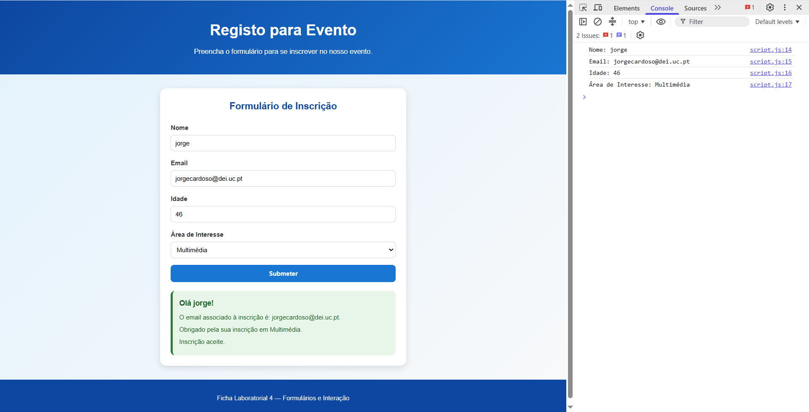

# Ficha Laboratorial 4: Formulários e Interação

## Objetivos

No final desta aula deverá ser capaz de:

- Criar formulários HTML.
- Utilizar os elementos de formulário mais comuns.
- Associar eventos JavaScript a formulários.
- Obter valores introduzidos pelo utilizador.
- Utilizar estruturas condicionais simples.
- Modificar a página em resposta à interação do utilizador.

---

# Contexto

Pretende-se desenvolver uma pequena página de registo para um evento.

A página deverá recolher informações do utilizador e apresentar uma mensagem personalizada.

---

# Preparação

Crie uma pasta para esta ficha:

```text
Ficha-Lab-04/
│
├── index.html
├── style.css
└── script.js
```

---

# 1. Estrutura do Formulário

Crie uma página contendo um formulário com os seguintes campos:

- Nome
- Email
- Idade

Todos os campos devem possuir uma etiqueta (`label`) associada.

Exemplo:

```html
<label for="nome">Nome</label>
<input type="text" id="nome">
```

---

# 2. Botão de Submissão

Adicione um botão ao formulário.

```html
<button type="submit">
    Submeter
</button>
```

Adicione também uma área vazia para apresentar resultados.

```html
<div id="resultado"></div>
```

---

# 3. Ler Dados do Formulário

Associe um evento de submissão ao formulário.

Quando o utilizador clicar em **Submeter**:

- impedir a submissão normal do formulário;
- obter os valores dos campos;
- escrever os valores na consola.

Exemplo de resultado:

```text
Nome: Ana
Email: ana@email.pt
Idade: 20
```

---

# 4. Apresentar uma Mensagem Personalizada

Utilize JavaScript para apresentar uma mensagem dentro do elemento:

```html
<div id="resultado"></div>
```

Exemplo:

```text
Olá Ana!

Obrigado pela sua inscrição.
```

---

# 5. Utilizar Variáveis

Guarde os valores introduzidos pelo utilizador em variáveis.

Exemplo:

```javascript
let nome = ...
let email = ...
let idade = ...
```

Construa a mensagem utilizando essas variáveis.

---

# 6. Utilizar Condicionais

Acrescente uma condição baseada na idade.

Se a idade for inferior a 18 anos:

```text
Participação sujeita a autorização.
```

Caso contrário:

```text
Inscrição aceite.
```

Utilize uma estrutura:

```javascript
if (...) {

}
else {

}
```

---

# 7. Alterar Estilos Dinamicamente

Dependendo do resultado da validação:

- mostrar a mensagem a verde para participantes adultos;
- mostrar a mensagem a laranja para participantes menores.

Exemplo:

```javascript
resultado.style.color = "green";
```

---

# 8. Validar Campos

Antes de processar a inscrição, verifique se todos os campos possuem conteúdo.

Caso algum campo esteja vazio:

```text
Por favor preencha todos os campos.
```

Mostre a mensagem na página.

---

# 9. Melhorar o Formulário

Utilize tipos adequados para os campos.

Exemplos:

```html
<input type="email">
```

```html
<input type="number">
```

Teste o comportamento do navegador.

---

# 10. Criar Elementos Dinamicamente

Em vez de substituir texto existente, crie um novo elemento HTML através de JavaScript.

Exemplo:

```javascript
const p = document.createElement("p");
```

Adicione esse elemento à página para apresentar a mensagem final.

---

# Desafio

Adicione um novo campo:

```text
Área de Interesse
```

Utilize uma lista de seleção (`select`) com opções como:

- Web Design
- Programação
- Inteligência Artificial
- Multimédia

A mensagem apresentada deverá incluir a opção selecionada.

Exemplo:

```text
Olá Ana!

Obrigado pela sua inscrição em Programação.
```

---

# Entrega

A pasta deverá apresentar a seguinte estrutura:

```text
lab04/
│
├── index.html
├── style.css
└── script.js
```

A página deverá:

- conter um formulário funcional;
- ler os dados introduzidos pelo utilizador;
- apresentar uma mensagem personalizada;
- utilizar JavaScript para processar a informação.

Screenshot exemplo:

---

# Questões de Reflexão

1. Qual a função do elemento `<form>`?
2. Qual a diferença entre um `label` e um `input`?
3. Porque é importante validar os dados introduzidos pelo utilizador?
4. O que acontece quando um evento de submissão é desencadeado?
5. Como pode o JavaScript modificar uma página já carregada?

---

# Objetivo da Ficha

Compreender como recolher informação introduzida pelo utilizador e utilizar JavaScript para processar essa informação, produzindo páginas Web interativas e personalizadas.