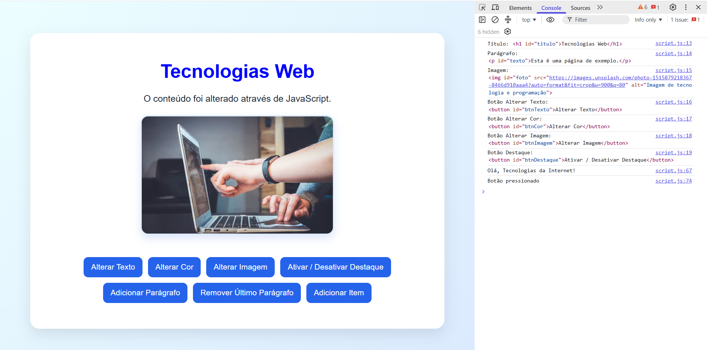

# Ficha Laboratorial 5: Manipulação do DOM

## Objetivos

No final desta aula deverá ser capaz de:

- Selecionar elementos HTML através de JavaScript.
- Modificar conteúdo existente numa página.
- Alterar atributos de elementos HTML.
- Adicionar e remover classes CSS.
- Criar e remover elementos HTML dinamicamente.
- Responder a eventos do utilizador.
- Compreender a relação entre HTML, CSS e DOM.

---

# Contexto

O JavaScript permite modificar páginas Web depois de estas serem carregadas pelo navegador.

Nesta ficha irá explorar o **DOM (Document Object Model)**, a representação da página Web utilizada pelo JavaScript.

---

# Preparação

Crie uma pasta para esta ficha:

```text
Ficha-Lab-05/
│
├── index.html
├── style.css
└── script.js
```

---

# 1. Criar a Página Base

Crie uma página contendo:

- um título;
- um parágrafo;
- uma imagem;
- três botões.

Exemplo:

```html
<h1>
    Tecnologias Web
</h1>

<p>
    Esta é uma página de exemplo.
</p>


<button id="btnTexto">
Alterar Texto
</button>

<button id="btnCor">
    Alterar Cor
</button>

<button id="btnImagem">
    Alterar Imagem
</button>
```

---

# 2. Selecionar Elementos

Utilize JavaScript para selecionar os elementos da página.

Experimente:

```javascript
document.querySelector()
```

### Exercício

Mostre os elementos selecionados na consola.

Exemplo:

```javascript
console.log(titulo);
```

---

# 3. Alterar Conteúdo

Quando o utilizador clicar no botão:

```text
Alterar Texto
```

altere o conteúdo do parágrafo.

Exemplo:

Antes:

```text
Esta é uma página de exemplo.
```

Depois:

```text
O conteúdo foi alterado através de JavaScript.
```

---

# 4. Alterar Atributos

Utilize JavaScript para alterar o atributo `src` da imagem.

Exemplo:

```javascript
imagem.src = "images/foto2.jpg";
```

### Exercício

Ao clicar no botão:

```text
Alterar Imagem
```

substitua a imagem apresentada por outra.

---

# 5. Alterar Estilos

Ao clicar no botão:

```text
Alterar Cor
```

altere:

- a cor do título;
- ou a cor de fundo da página.

Exemplo:

```javascript
titulo.style.color = "blue";
```

---

# 6. Utilizar Classes CSS

Crie uma classe CSS:

```css
.destaque {
    background-color: yellow;
    border: 2px solid orange;
}
```

### Exercício

Adicione a classe ao parágrafo através de JavaScript.

Exemplo:

```javascript
paragrafo.classList.add("destaque");
```

---

# 7. Remover Classes CSS

Crie um segundo botão:

```text
Remover Destaque
```

Quando o utilizador clicar:

```javascript
paragrafo.classList.remove("destaque");
```

---

# 8. Alternar Classes

Utilize:

```javascript
classList.toggle()
```

### Exercício

Substitua os dois botões anteriores por um único botão:

```text
Ativar / Desativar Destaque
```

---

# 9. Criar Elementos Dinamicamente

Crie um botão:

```text
Adicionar Parágrafo
```

Quando o utilizador clicar:

- criar um novo elemento `<p>`;
- adicionar texto ao elemento;
- inserir o elemento na página.

Exemplo:

```javascript
const p = document.createElement("p");
p.textContent = "Novo parágrafo";
```

---

# 10. Remover Elementos

Crie um botão:

```text
Remover Último Parágrafo
```

### Exercício

Remova o último parágrafo criado dinamicamente.

---

# 11. Criar uma Lista Dinâmica

Adicione uma lista vazia:

```html
<ul id="lista"></ul>
```

Crie um botão:

```text
Adicionar Item
```

Sempre que o utilizador clicar:

- criar um novo elemento `<li>`;
- adicionar texto;
- acrescentar o elemento à lista.

Resultado esperado:

```text
• Item 1
• Item 2
• Item 3
```

---

# Desafio

Crie uma pequena aplicação de gestão de tarefas (*To-Do List*).

A aplicação deverá permitir:

- adicionar tarefas;
- marcar tarefas visualmente;
- remover tarefas.

Não é necessário guardar a informação após fechar o navegador.

---

# Resultado final

A pasta deverá apresentar a seguinte estrutura:

```text
Ficha-Lab-05/
│
├── index.html
├── style.css
└── script.js
```

A aplicação deverá demonstrar:

- seleção de elementos;
- manipulação de conteúdo;
- manipulação de atributos;
- utilização de classes CSS;
- criação dinâmica de elementos.

Screenshot exemplo:

---

# Questões de Reflexão

1. O que é o DOM?
2. Qual a diferença entre `getElementById()` e `querySelector()`?
3. Qual a diferença entre alterar conteúdo e alterar atributos?
4. Para que serve `classList`?
5. Porque é útil criar elementos HTML dinamicamente?

---

# Objetivo da Ficha

Compreender como o JavaScript pode manipular a estrutura de uma página Web através do DOM, permitindo alterar conteúdo, estilos e elementos em resposta às ações do utilizador.


---
---
# Exercícios Extra
---
---


## Ex 1

Observe o código HTML do ficheiro `ex1.html` na pasta `ex1`.
- Adicione um script JavaScript:
  - Crie um ficheiro `ex1.js` dentro da pasta `ex1`
  - Faça a "ligação" entre o HTML e o JavaScript incluindo o elemento `<script src="ex1.js"></script>` antes do fim do `<body>`.

No script que acabou de adicionar, escreva código que:
1. Modifique o conteúdo da div#one para: "This is a div".
2. Modifique o conteúdo da div#two para: "This is a `<div>`".


**Nota: o script não precisa de ser interactivo. As modificações podem ocorrer logo que a página é carregada pelo browser.**


## Ex 3
Observe o conteúdo dos ficheiros na pasta `ex3`.
Adicione JavaScript de forma a que quando o *utilizador clicar*:

1. No botão `One`, o conteúdo da div#one seja modificado para: "This is a div".
2. No botão `Two`, o conteúdo da div#two seja modificado para: "This is a `<div>`".

**Nota: Consegue fazer com que os botões funcionem como *toggle*: ou seja voltando a clicar, se desfaça a modificação**


## Ex 4
Observe o código da pasta `ex4`. Usando JavaScript faça com que um clique nos botões tenha como resultado o seguinte:
1. (Botão 1) Adicione um elemento `<span>` vazio dentro da `div#one`
2. (Botão 2) Adicione um link para `http://uc.pt` dentro da `div#two`.
3. (Botão 3) Remova o elemento `<span>` da div#three.

## Ex 5
Observe o código da pasta `ex5`. Usando JavaScript:

1. Adicione um listener de clique à `div#one`. Quando clicada, a propriedade CSS `left` da `div#one` deve ser alterada para `200px`.
2. Adicione um listener de `mouseenter` à `div#two`. Quando o cursor do rato entrar na div, deve alterar o seu fundo para vermelho.
3. Adicione também um listener de `mouseleave` para reverter o efeito.
