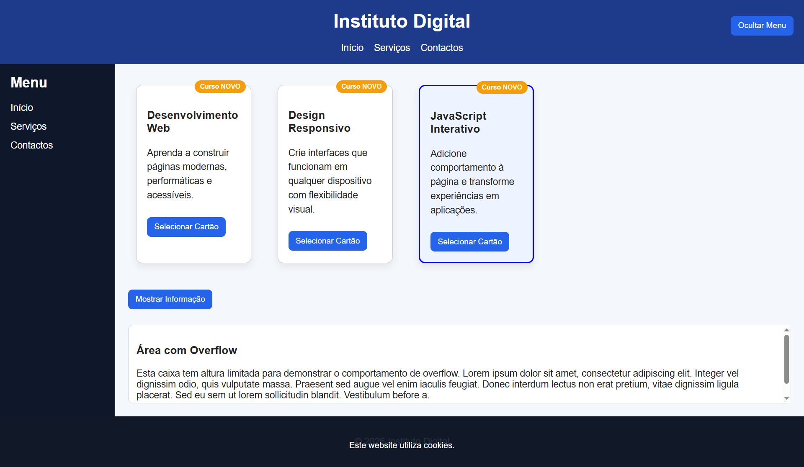

# Ficha Laboratorial 6: Layouts, Posicionamento e Classes CSS

## Objetivos

No final desta aula deverá ser capaz de:

- Compreender e aplicar o modelo de caixas (*Box Model*).
- Utilizar diferentes tipos de apresentação de elementos (`display`).
- Posicionar elementos numa página Web.
- Controlar o comportamento de conteúdo excedente (*overflow*).
- Manipular classes CSS através de JavaScript.
- Criar componentes de interface simples utilizando HTML, CSS e JavaScript.

---

# Contexto

Nesta ficha irá desenvolver uma pequena página institucional contendo:

- um menu lateral;
- cartões informativos;
- secções expansíveis;
- uma mensagem fixa de notificação.

O objetivo é explorar os conceitos de layout introduzidos na aula teórica.

---

# Preparação

Crie os ficheiros para esta ficha:

```text
Ficha-Lab-06/
│
├── index.html
├── style.css
└── script.js
```

---

# 1. Criar a Estrutura da Página

Crie uma página contendo:

- cabeçalho;
- menu de navegação;
- área principal;
- três cartões informativos;
- rodapé.

Estrutura sugerida:

```text
+--------------------------+
| Header                   |
+--------------------------+
| Menu                     |
+--------------------------+
| Card 1                   |
| Card 2                   |
| Card 3                   |
+--------------------------+
| Footer                   |
+--------------------------+
```

---

# 2. Explorar o Box Model

__Nota:__ Não use Flexbox nem Grid nesta ficha.

Aplique aos cartões:

```css
padding
margin
border
```

Exemplo:

```css
.card {
    padding: 20px;
    margin: 15px;
    border: 1px solid #cccccc;
    width: 200px;
}
```

### Exercício

Experimente diferentes valores para:

- `padding`
- `margin`
- `border-width`

Observe as diferenças visuais.

---

# 3. Utilizar Diferentes Valores de Display

Crie três blocos de conteúdo.

Experimente os seguintes valores:

```css
display: block;
```

```css
display: inline;
```

```css
display: inline-block;
```

### Exercício

Compare o comportamento dos elementos em cada caso.

---

# 4. Criar um Menu Horizontal

Crie uma lista de navegação.

Exemplo:

```html
<ul>
    <li>Início</li>
    <li>Serviços</li>
    <li>Contactos</li>
</ul>
```

Utilize CSS para apresentar os elementos lado a lado.

---

# 5. Position Relative

Adicione um pequeno distintivo a um dos cartões.

Exemplo:

```text
Curso
[NOVO]
```

Utilize:

```css
position: relative;
```

e

```css
position: absolute;
```

para posicionar o distintivo.

---

# 6. Position Fixed

Crie uma notificação fixa no fundo da página.

Exemplo:

```text
Este website utiliza cookies.
```

A mensagem deverá permanecer visível quando a página é percorrida.

Utilize:

```css
position: fixed;
```

---

# 7. Explorar Overflow

Crie uma caixa de conteúdo com altura limitada.

Exemplo:

```css
height: 150px;
overflow: auto;
```

Adicione texto suficiente para provocar overflow.

### Exercício

Experimente:

```css
overflow: visible;
overflow: hidden;
overflow: scroll;
overflow: auto;
```

Observe o comportamento.

---

# 8. Manipular Classes CSS

Crie uma classe:

```css
.selecionado {
    border: 3px solid blue;
    background-color: #eef4ff;
}
```

Selecione um cartão através de JavaScript.

Exemplo:

```javascript
card.classList.add("selecionado");
```

---

# 9. Alternar Estados Visuais

Adicione um botão:

```text
Selecionar Cartão
```

Quando o utilizador clicar no botão:

```javascript
card.classList.toggle("selecionado");
```

O cartão deverá alternar entre os dois estados.

---

# 10. Painel Expansível

Crie uma secção de conteúdo adicional.

Exemplo:

```text
Mais Informação
```

Inicialmente a secção deve estar escondida.

Ao clicar num botão:

```text
Mostrar Informação
```

a secção deverá aparecer.

Ao clicar novamente deverá desaparecer.

Sugestão:

```css
.oculto {
    display: none;
}
```

```javascript
element.classList.toggle("oculto");
```

__Nota:__ Existe um elemento HTML (https://developer.mozilla.org/en-US/docs/Web/HTML/Reference/Elements/details) que tem um comportamento semelhante e não precisa de JavaScript, mas neste exercício queremos treinar o uso de JavaScript.

---

# 11. Menu Lateral

Crie um menu lateral simples.

Exemplo:

```text
Menu
- Início
- Serviços
- Contactos
```

Inicialmente o menu deverá estar escondido.

Adicione um botão:

```text
Mostrar Menu
```

Utilize JavaScript para alternar entre:

- menu visível;
- menu oculto.

---


# Resultado final

A pasta deverá apresentar a seguinte estrutura:

```text
Ficha-Lab-06/
│
├── index.html
├── style.css
└── script.js
```

A página deverá demonstrar:

- utilização do Box Model;
- utilização de Display;
- utilização de Position;
- utilização de Overflow;
- manipulação de classes CSS através de JavaScript.

Screenshot exemplo:


---

# Questões de Reflexão

1. Qual a diferença entre `margin` e `padding`?
2. Qual a diferença entre `display: block` e `display: inline-block`?
3. Em que situações é útil utilizar `position: fixed`?
4. Qual a diferença entre ocultar um elemento com CSS e removê-lo do DOM?
5. Porque é vantajoso alterar classes CSS em vez de modificar diretamente estilos através de JavaScript?

---

# Objetivo da Ficha

Aprender a construir layouts mais ricos e componentes de interface reutilizáveis através da combinação de HTML, CSS intermédio e JavaScript para manipulação de classes e estados visuais.

## Exercícios extras sugeridos
- [OutrosExercicios/Ficha-PL-2CSS-04-Posicionamento/enunciado.md](/OutrosExercicios/Ficha-PL-2CSS-04-Posicionamento/enunciado.md): Ex 1, Ex 3, Ex 5
- [OutrosExercicios/Ficha-PL-2CSS-08/enunciado.md](/OutrosExercicios/Ficha-PL-2CSS-08/enunciado.md): Ex 1, Ex 2