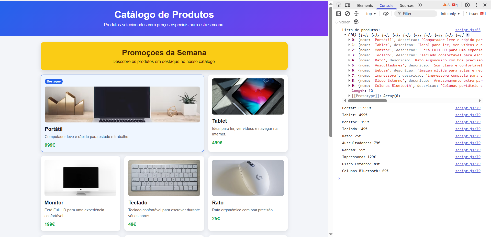

# Ficha Laboratorial 8: CSS Grid e Geração de Conteúdo com JavaScript

## Objetivos

No final desta aula deverá ser capaz de:

- Construir layouts bidimensionais utilizando CSS Grid.
- Utilizar linhas, colunas e áreas de grelha.
- Criar grelhas adaptadas a diferentes tipos de conteúdo.
- Utilizar ciclos em JavaScript.
- Utilizar arrays para armazenar informação.
- Gerar elementos HTML dinamicamente.

---

# Contexto

Pretende-se construir uma página de catálogo de produtos.

A informação dos produtos será armazenada em JavaScript e apresentada através de uma grelha criada com CSS Grid.

---

# Preparação

Crie os ficheiros para esta ficha:

```text
Ficha-Lab-08/
│
├── index.html
├── style.css
└── script.js
```

---

# Parte 1. HTML Base

## Exercício 1

Crie uma página com a seguinte estrutura:

```html
<header>
<main>
<footer>
```

No interior do elemento `<main>`, adicione um contentor para a grelha:

```html
<section id="produtos">
</section>
```

---

## Exercício 2

Adicione um título à página.

Exemplo:

```text
Catálogo de Produtos
```

---

# Parte 2. Primeira Grelha

## Exercício 3

Transforme o elemento `#produtos` numa grelha CSS.

Defina:

- 3 colunas;
- espaçamento entre elementos.

Exemplo de propriedades a explorar:

```css
display: grid;
grid-template-columns;
gap;
```

__Nota:__ Guia  Grid: https://css-tricks.com/complete-guide-css-grid-layout/

---

## Exercício 4

Crie manualmente 6 cartões de produto.

Cada cartão deve conter:

- nome;
- descrição curta;
- preço.

Exemplo:

```text
Produto A
Descrição do produto.
9.99€
```


---

## Exercício 5

Aplique estilos aos cartões:

- fundo;
- margens;
- espaçamento interno;
- cantos arredondados.

---

# Parte 3. Grid Avançado

## Exercício 6

Experimente diferentes configurações de colunas.

Por exemplo:

```css
grid-template-columns: 1fr 1fr;
```

e

```css
grid-template-columns: 1fr 1fr 1fr 1fr;
```

Observe o resultado.

---

## Exercício 7

Crie um cartão em destaque ocupando duas colunas.

Investigue a utilização de:

```css
grid-column
```

---

## Exercício 8

Crie uma zona promocional no início da grelha.

Exemplo:

```text
Promoções da Semana
```

Esta zona deverá ocupar toda a largura disponível.

---

# Parte 4. Arrays em JavaScript

## Exercício 9

Crie um array contendo vários produtos.

Exemplo:

```javascript
const produtos = [
    "Portátil",
    "Tablet",
    "Monitor",
    "Teclado",
    "Rato"
];
```

Apresente o conteúdo na consola.

---

## Exercício 10

Utilize um ciclo para percorrer todos os elementos do array.

Apresente cada produto na consola.

---

## Exercício 11

Crie um segundo array contendo preços.

Exemplo:

```javascript
const precos = [
    999,
    499,
    199,
    49,
    25
];
```

---

# Parte 5. Criação Dinâmica de Conteúdo

## Exercício 12

Remova os cartões HTML criados manualmente.

Os cartões passarão a ser criados através de JavaScript.

---

## Exercício 13

Utilize um ciclo para criar um elemento HTML para cada produto.

Cada cartão deverá conter:

- nome;
- preço.

Adicione os cartões ao contentor da grelha.

---

## Exercício 14

Adicione uma classe CSS aos elementos criados.

Exemplo:

```javascript
element.classList.add("produto");
```

---

## Exercício 15

Crie pelo menos 10 produtos.

Verifique como a grelha se adapta automaticamente à quantidade de elementos.

---

# Parte 6. Arrays de Objetos

## Exercício 16

Substitua os arrays anteriores por um único array de objetos.

Exemplo:

```javascript
const produtos = [
    {
        nome: "Portátil",
        preco: 999
    },
    {
        nome: "Tablet",
        preco: 499
    }
];
```

---

## Exercício 17

Atualize o código de geração dinâmica para utilizar os objetos.

Apresente:

- nome;
- preço.

---

# Desafio

Adicione um terceiro atributo:

```javascript
imagem
```

Utilize esse atributo para apresentar uma imagem em cada cartão.

Exemplo:

```javascript
{
    nome: "Portátil",
    preco: 999,
    imagem: "images/portatil.jpg"
}
```

---

# Resultado final

A pasta deverá apresentar a seguinte estrutura:

```text
Ficha-Lab-08/
│
├── index.html
├── style.css
└── script.js
```

A página deverá demonstrar:

- Utilização de CSS Grid.
- Grelha com múltiplas colunas.
- Cartão em destaque.
- Utilização de arrays.
- Utilização de ciclos.
- Criação dinâmica de elementos HTML.
- Aplicação dinâmica de classes CSS.
- Array de objetos.
- Catálogo apresentado através da grelha.

Screenshot exemplo:


---

# Questões de reflexão

1. Qual é a vantagem de utilizar CSS Grid para apresentar um catálogo de produtos em vez de organizar os cartões apenas com margens ou `display: block`?

2. O que acontece à grelha quando altera o valor de `grid-template-columns`? Compare, por exemplo, uma grelha com 2 colunas, 3 colunas e 4 colunas.

6. Que impacto teria adicionar muitos produtos ao HTML manualmente? Que vantagens existem em gerar os cartões através de JavaScript?

7. Como é que o array de objetos ajuda a organizar a informação dos produtos?

8. Que partes do cartão são criadas pelo JavaScript e que partes são controladas pelo CSS?

9. Porque é importante adicionar classes CSS aos elementos criados dinamicamente com JavaScript?

10. Se quisesse alterar o aspeto de todos os cartões, faria essa alteração no JavaScript ou no CSS? Justifique.

12. Como poderia adaptar a grelha para funcionar melhor em ecrãs pequenos, como telemóveis?

14. Que problemas poderiam surgir se o nome de uma classe usado no JavaScript não correspondesse ao nome definido no CSS?

