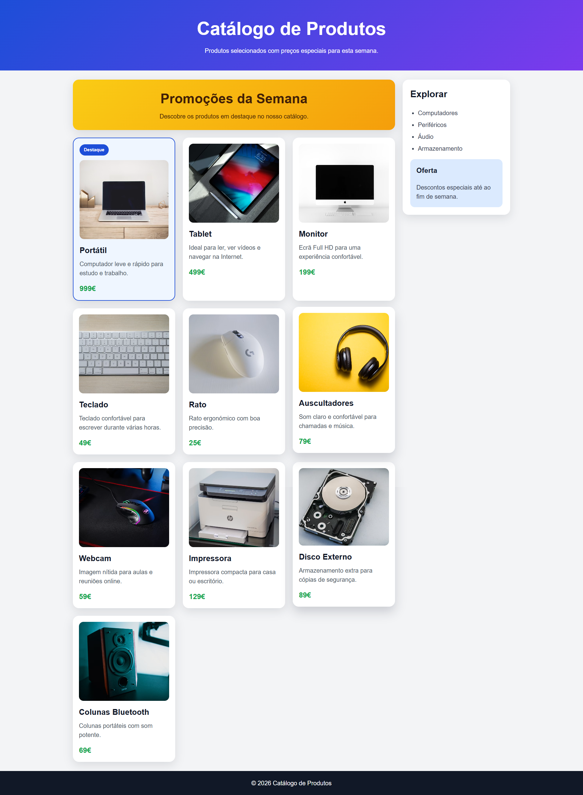

# Ficha Laboratorial 9: Responsive Design e Imagens Responsivas

## Objetivos

No final desta aula deverá ser capaz de:

- Adaptar páginas Web a diferentes dimensões de ecrã.
- Utilizar media queries.
- Aplicar uma estratégia mobile-first.
- Tornar imagens responsivas.
- Adaptar layouts CSS Grid a dispositivos móveis.
- Utilizar objetos JavaScript para representar informação estruturada.

---

# Contexto

Na ficha anterior foi desenvolvido um catálogo de produtos utilizando CSS Grid e JavaScript.

Pretende-se agora adaptar esse catálogo para funcionar corretamente em:

- telemóveis;
- tablets;
- computadores.

---

# Preparação

Copie os ficheiros da Ficha-Lab-08 para esta ficha:

```text
Ficha-Lab-09/
│
├── index.html
├── style.css
└── script.js
```

---

# Parte 1. Avaliação do layout atual

## Exercício 1

Abra o trabalho da ficha anterior.

Utilize as Developer Tools do browser para simular diferentes dispositivos:

- iPhone SE
- iPhone 14
- iPad
- Desktop

Identifique problemas de visualização.

---

## Exercício 2

Liste pelo menos três problemas encontrados.

Exemplos:

- imagens demasiado grandes;
- texto demasiado pequeno;
- excesso de colunas em ecrãs reduzidos.

---

# Parte 2. Mobile First

## Exercício 3

Adapte a folha de estilos para que a versão base seja adequada a dispositivos móveis.

Utilize unidades relativas sempre que possível:

```css
rem
%
vw
vh
```

---

# Parte 3. Imagens Responsivas

## Exercício 4

Adicione uma imagem a cada produto do catálogo (se não o tiver já feito na ficha anterior).

---

## Exercício 5

Torne as imagens responsivas em HTML, seguindo as recomendações da MDN sobre imagens responsivas:

https://developer.mozilla.org/en-US/docs/Web/HTML/Guides/Responsive_images

O objetivo é que:

- as imagens nunca ultrapassem a largura disponível do seu conteúdo;
- mantenham as proporções originais;
- o browser escolha a imagem mais adequada consoante a resolução e o tamanho do ecrã.

Utilize técnicas como:

- `srcset` para indicar várias versões da mesma imagem;
- `sizes` para definir o espaço que a imagem ocupa no layout;
- `width` e `height` para preservar proporções;
- `max-width: 100%` e `height: auto` no CSS, quando necessário.

Exemplo de estrutura aconselhada:

```html

```

Teste o comportamento para diferentes larguras de ecrã (por exemplo 320px, 768px, 1024px e 1440px).

---

# Parte 4. Media Queries

## Exercício 6

Crie uma media query para dispositivos com largura mínima de 768px.

Objetivo:

- aumentar o número de colunas da grelha.

---

## Exercício 7

Crie uma segunda media query para dispositivos com largura mínima de 1200px.

Adapte:

- número de colunas;
- espaçamento entre cartões.

---

# Parte 5. Layout Adaptativo

## Exercício 8

Adicione uma barra lateral (`aside`) ao catálogo.

Na versão móvel a barra lateral deve surgir abaixo do conteúdo principal.

---

## Exercício 9

Utilize CSS Grid ou Flexbox para que, em dispositivos desktop, a barra lateral passe a surgir ao lado do conteúdo principal.

---

# Parte 6. Objetos JavaScript
__Nota:__ Caso não tenha feito isto na ficha anterior.

## Exercício 10

Substitua os dados atuais por um array de objetos.

Exemplo:

```javascript
const produtos = [
    {
        nome: "Portátil",
        categoria: "Computadores",
        preco: 999
    }
];
```

---

## Exercício 11

Atualize a geração dinâmica dos cartões para apresentar:

- nome;
- categoria;
- preço;
- imagem.

Toda a informação deverá ser obtida a partir dos objetos JavaScript.

---

# Exercício 12. Teste Final

Teste o website nas seguintes larguras:

```text
320px
768px
1024px
1440px
```

Verifique:

- legibilidade;
- adaptação da grelha;
- comportamento das imagens;
- posicionamento da barra lateral.

Corrija eventuais problemas encontrados.

---

# Desafio

Investigue a utilização de:

```css
repeat()
auto-fit
minmax()
```

e adapte a grelha para determinar automaticamente o número de colunas disponíveis.

---


# Resultado final

A pasta deverá apresentar a seguinte estrutura:

```text
Ficha-Lab-09/
│
├── index.html
├── style.css
└── script.js
```

A página deverá demonstrar:

- [ ] Imagens responsivas.
- [ ] Layout mobile-first.
- [ ] Media queries.
- [ ] Grelha adaptável a diferentes dispositivos.
- [ ] Barra lateral responsiva.
- [ ] Utilização de objetos JavaScript.
- [ ] Conteúdo gerado dinamicamente.
- [ ] Testes realizados em múltiplas resoluções.

Screenshot exemplo:



## Exercícios extras sugeridos
- [OutrosExercicios/Ficha-PL-2CSS-07-Grid-and-Responsive-Web-Design/enunciado.md](/OutrosExercicios/Ficha-PL-2CSS-07-Grid-and-Responsive-Web-Design/enunciado.md): Ex 0, Ex 3, Ex 4, Ex 5, Ex 6