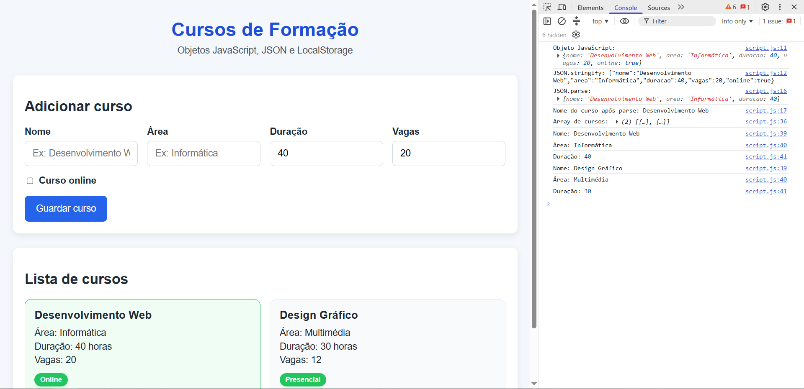

# Ficha Laboratorial 11: Objetos JavaScript e JSON

## Objetivos

No final desta aula deverá ser capaz de:

- Criar objetos JavaScript.
- Aceder a propriedades de objetos.
- Utilizar arrays de objetos.
- Percorrer estruturas de dados complexas.
- Representar informação em formato JSON.
- Converter entre objetos JavaScript e JSON.
- Gerar conteúdo HTML a partir de dados estruturados.

---

# Contexto

Pretende-se desenvolver uma pequena aplicação para apresentar informação sobre cursos de formação.

A informação será armazenada em objetos JavaScript e posteriormente convertida para JSON.

---

# Parte 1. Objetos JavaScript

## Exercício 1

Crie um objeto que represente um curso.

O objeto deve conter:

- nome;
- área;
- duração;
- número de vagas.

Exemplo:

```javascript
const curso = {
    nome: "Desenvolvimento Web",
    area: "Informática",
    duracao: 40,
    vagas: 20
};
```

---

## Exercício 2

Apresente na consola os valores das propriedades do objeto.

Experimente diferentes formas de acesso às propriedades.

---

# Parte 2. Arrays de Objetos

## Exercício 3

Crie um array contendo pelo menos cinco cursos.

Cada curso deve ser representado por um objeto.

---

## Exercício 4

Utilize um ciclo para percorrer todos os cursos.

Apresente na consola:

```text
Nome
Área
Duração
```

de cada curso.

---

## Exercício 5

Crie dinamicamente um cartão HTML para cada curso.

Cada cartão deve apresentar:

- nome;
- área;
- duração;
- vagas.

---

# Parte 3. Estruturas de Dados

## Exercício 6

Adicione novas propriedades aos cursos.

Por exemplo:

```javascript
{
    nome: "...",
    area: "...",
    duracao: 40,
    vagas: 20,
    online: true
}
```

Apresente essa informação nos cartões.

---

## Exercício 7

Utilize uma estrutura condicional para destacar cursos online.

Sugestão:

- adicionar uma classe CSS específica;
- apresentar uma etiqueta "Online".

---

# Parte 4. Introdução ao JSON

## Exercício 8

JSON é uma forma de representar dados em texto. Em vez de guardar um objeto JavaScript apenas na memória, podemos transformar esse objeto numa string JSON para o guardar, enviar ou partilhar entre aplicações.

Utilize:

```javascript
JSON.stringify()
```

para converter um objeto JavaScript para JSON.

Crie um objeto com a informação de um curso e faça `console.log()` do resultado.

Exemplo:

```javascript
const curso = {
    nome: "Desenvolvimento Web",
    area: "Informática",
    duracao: 40,
    vagas: 20
};

console.log(JSON.stringify(curso));
```

Compare a sintaxe com a utilizada nos objetos JavaScript.

Dica:

- em JavaScript, as propriedades de um objeto podem ser escritas sem aspas;
- em JSON, as chaves têm de estar entre aspas;
- JSON representa dados em texto, não um objeto JavaScript em memória.

---

## Exercício 9

Utilize:

```javascript
JSON.parse()
```

para converter novamente o JSON para um objeto JavaScript.

Verifique que as propriedades podem voltar a ser utilizadas normalmente.

Exemplo:

```javascript
const jsonCurso = '{"nome":"Desenvolvimento Web","area":"Informática","duracao":40}';
const objetoCurso = JSON.parse(jsonCurso);

console.log(objetoCurso.nome);
```

---

# Parte 5. Integração com LocalStorage

## Exercício 11

Crie um array de objetos JavaScript com vários cursos.

Agora, guarde esse array no `localStorage` usando `JSON.stringify()`.

Exemplo:

```javascript
const cursos = [
    { nome: "Desenvolvimento Web", area: "Informática", duracao: 40 },
    { nome: "Design Gráfico", area: "Multimedia", duracao: 30 }
];

localStorage.setItem("cursos", JSON.stringify(cursos));
```

Depois, leia novamente os dados do `localStorage` e converta-os com `JSON.parse()`.

Apresente o resultado na consola.

---

## Exercício 12

Crie um formulário simples com três campos:

- nome;
- área;
- duração.

Quando o utilizador clicar num botão:

1. cria um objeto JavaScript com esses valores;
2. guarda esse objeto num array;
3. guarda o array no `localStorage` com `JSON.stringify()`;
4. cria dinamicamente um cartão HTML com a informação do curso;
5. limpa os campos do formulário.

Ao carregar a página, o script deve:

- ler os dados guardados em `localStorage`;
- converter com `JSON.parse()`;
- reconstruir a lista de cartões HTML automaticamente.

Assim, a informação fica persistente mesmo depois de recarregar a página.

```javascript
const dados = localStorage.getItem("cursos");
const cursosGuardados = JSON.parse(dados);
```

__Nota:__ Às vezes é útil _limpar_ a localStorage do browser para a página que estamos a desenvolver. Pode fazer isso abrindo a consola JavaScript e escrevendo `localStorage.clear()`

---

# Resultado final

A pasta deverá apresentar a seguinte estrutura:

```text
Ficha-Lab-09/
│
├── index.html
├── style.css
└── script.js
```

A página deverá demonstrar:

- [ ] Criação de objetos JavaScript.
- [ ] Utilização de arrays de objetos.
- [ ] Percurso de estruturas de dados com ciclos.
- [ ] Criação dinâmica de conteúdo HTML.
- [ ] Utilização de propriedades de objetos.
- [ ] Conversão para JSON com `JSON.stringify()`.
- [ ] Conversão para objetos com `JSON.parse()`.
- [ ] Geração de conteúdo a partir de dados


Screenshot exemplo:


