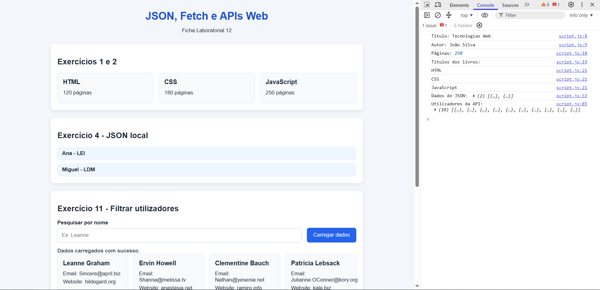

# Ficha Laboratorial 12: JSON, Fetch e APIs Web

## Objetivos

No final desta aula deverá ser capaz de:

- Compreender a estrutura de documentos JSON.
- Utilizar objetos e arrays em JavaScript.
- Consumir dados externos utilizando a função `fetch()`.
- Processar respostas em formato JSON.
- Criar conteúdo HTML dinamicamente a partir de dados obtidos de uma API.
- Tratar erros durante pedidos HTTP.

---

# Contexto

As aplicações Web modernas obtêm frequentemente informação a partir de serviços externos.

Nesta ficha irá explorar:

- JSON;
- APIs Web;
- Fetch API;
- criação dinâmica de conteúdo baseada em dados externos.

---

# Preparação

Crie os ficheiros para esta ficha:

```text
Ficha-Lab-12/
│
├── index.html
├── style.css
└── script.js
```

---

# 1. Explorar um Objeto JavaScript

Considere o seguinte objeto:

```javascript
const livro = {
    titulo: "Tecnologias Web",
    autor: "João Silva",
    paginas: 250
};
```

### Exercício

Apresente na consola:

- título;
- autor;
- número de páginas.

---

# 2. Explorar um Array de Objetos

Considere o seguinte array:

```javascript
const livros = [
    {
        titulo: "HTML",
        paginas: 120
    },
    {
        titulo: "CSS",
        paginas: 180
    },
    {
        titulo: "JavaScript",
        paginas: 250
    }
];
```

### Exercício

Percorra o array e apresente os títulos na consola.

---

# 3. Criar Conteúdo HTML Dinamicamente

Crie um elemento vazio na página:

```html
<div id="livros"></div>
```

### Exercício

Utilize JavaScript para criar um cartão para cada livro do exercício anterior.

Resultado esperado:

```text
+------------------+
| HTML             |
| 120 páginas      |
+------------------+
```

---

# 4. Explorar um Documento JSON

Crie um ficheiro na pasta desta ficha:

```text
Ficha-Lab-12/
│
└── dados.json

```

com o seguinte conteúdo:

```json
[
    {
        "nome": "Ana",
        "curso": "LEI"
    },
    {
        "nome": "Miguel",
        "curso": "LDM"
    }
]
```

### Exercício

Observe a estrutura do ficheiro JSON.

Identifique:

- arrays;
- objetos;
- propriedades;
- valores.

---

# 5. Ler um Ficheiro JSON com Fetch

Utilize `fetch()` para carregar o ficheiro JSON anterior.

Exemplo:

```javascript
fetch("dados.json")
```

### Exercício

Apresente o conteúdo carregado na consola.

---

# 6. Mostrar Dados na Página

Crie uma área vazia:

```html
<div id="alunos"></div>
```

### Exercício

Apresente na página os dados obtidos do ficheiro JSON.

Exemplo:

```text
Ana - LEI
Miguel - LDM
```

---

# 7. Consumir uma API Pública

Utilize a seguinte API:

```text
https://jsonplaceholder.typicode.com/users
```

### Exercício

Carregue os dados utilizando `fetch()`.

Apresente o resultado na consola.

---

# 8. Criar Cartões de Utilizador

Utilizando os dados da API anterior, apresente para cada utilizador:

- nome;
- email;
- website.

Exemplo:

```text
+----------------------+
| Leanne Graham        |
| email@exemplo.com    |
| website.com          |
+----------------------+
```

Os cartões deverão ser criados dinamicamente.

---

# 9. Tratar Erros

Adicione tratamento de erros ao pedido.

Exemplo:

```javascript
.catch(...)
```

### Exercício

Apresente uma mensagem de erro na consola quando o pedido falhar.

---

# 10. Apresentar uma Mensagem de Carregamento

Antes de iniciar o pedido à API, apresente:

```text
A carregar dados...
```

Quando os dados forem recebidos, remova essa mensagem.

---

# 11. Filtrar Dados
Crie um formulário simples no HTML, com um campo de input e um botão.

O carregamento de dados da API deverá acontecer apenas quando o utilizador pressionar o botão do formulário.

Além disso, deverá filtrar os resultados da API a converter em cartões usando o texto que o utilizador introduziu no campo de texto.

Por exemplo: 
```text
+------------------+   ┌──────────────┐
| Le               |   │   Procurar   │
+------------------+   └──────────────┘
```
Mostra apenas utilizadores cujo nome comece por "Le"


Explore as funções JavaScript sobre strings, para ajudar a filtrar:
* [string].`startsWith()`: verifica se uma string começa com um texto específico.
* [string].`endsWith()`: verifica se uma string termina com um texto específico.
* [string].`includes()`: verifica se uma string contém um determinado texto.


---

# 12. Desafio Final

Crie uma pequena aplicação que:

- obtenha dados de uma API pública;
- apresente uma mensagem de carregamento;
- trate erros;
- gere cartões HTML dinamicamente para apresentar os resultados.

A interface deverá ser construída inteiramente com HTML, CSS e JavaScript.

---

# Resultado final

A pasta deverá apresentar a seguinte estrutura:

```text
Ficha-Lab-12/
│
├── index.html
├── style.css
├── script.js
└── dados.json
```

A aplicação deverá demonstrar:

- utilização de JSON;
- utilização de `fetch()`;
- consumo de APIs Web;
- criação dinâmica de elementos HTML;
- tratamento básico de erros.

Screenshot exemplo:



---

# Questões de Reflexão

1. O que é JSON?
2. Qual a diferença entre um objeto JavaScript e um documento JSON?
3. Qual a função da API `fetch()`?
4. Porque é importante tratar erros em pedidos HTTP?
5. Quais as vantagens de obter dados através de APIs externas?

---

