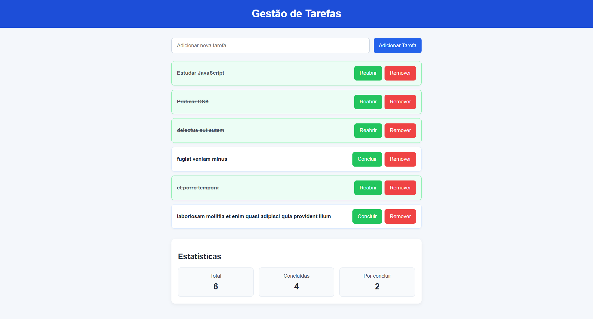

# Ficha Laboratorial 13: Integração Final: HTML, CSS e JavaScript

## Objetivos

No final desta aula deverá ser capaz de:

- Integrar HTML, CSS e JavaScript numa aplicação Web simples.
- Utilizar manipulação avançada do DOM.
- Utilizar delegação de eventos.
- Criar interfaces dinâmicas.
- Trabalhar com dados obtidos através de Fetch.
- Atualizar a interface em função das ações do utilizador.
- Consolidar os conhecimentos adquiridos ao longo da unidade curricular.

---

# Contexto

Nas fichas anteriores desenvolveu uma aplicação que:

- utiliza HTML semântico;
- utiliza CSS responsivo;
- gera conteúdo dinamicamente;
- obtém informação através de Fetch.

Pretende-se agora consolidar estes conhecimentos construindo uma pequena aplicação de gestão de tarefas.

---

# Parte 1. Estrutura Base

## Exercício 1

Crie uma página contendo:

- um título;
- um formulário para adicionar tarefas;
- uma lista de tarefas;
- uma área para apresentar estatísticas.

Estrutura sugerida:

```html
<header>
<main>
    <form>
    <section id="tarefas">
    <section id="estatisticas">
</main>
```

---

# Parte 2. Adicionar Tarefas

## Exercício 2

Crie um formulário que permita introduzir:

- descrição da tarefa.

Adicione um botão:

```text
Adicionar Tarefa
```

---

## Exercício 3

Quando o formulário for submetido:

- impedir a submissão normal;
- criar um novo elemento HTML;
- adicionar a tarefa à lista.

---

# Parte 3. Objetos e Dados

## Exercício 4

Represente cada tarefa através de um objeto JavaScript.

Exemplo:

```javascript
{
    descricao: "Estudar JavaScript",
    concluida: false
}
```

---

## Exercício 5

Armazene todas as tarefas num array.

Sempre que uma nova tarefa for criada:

- adicionar o objeto ao array;
- atualizar a interface.

---

# Parte 4. Delegação de Eventos

## Exercício 6

Adicione um botão "Concluir" a cada tarefa criada.

---

## Exercício 7

Utilize delegação de eventos para gerir os cliques nos botões das tarefas.

Sugestão:

```javascript
addEventListener("click", ...)
```

aplicado ao contentor da lista.

---

## Exercício 8

Quando uma tarefa for marcada como concluída:

- atualizar o objeto correspondente;
- alterar a aparência visual da tarefa.

Por exemplo:

- texto riscado;
- cor diferente.

---

# Parte 5. Remoção Dinâmica

## Exercício 9

Adicione um botão:

```text
Remover
```

em cada tarefa.

Utilize novamente delegação de eventos para remover tarefas.

---

# Parte 6. Estatísticas

## Exercício 10

Apresente dinamicamente:

- número total de tarefas;
- número de tarefas concluídas;
- número de tarefas por concluir.

A informação deve ser atualizada sempre que existam alterações.

---

# Parte 7. Integração com Dados Externos

## Exercício 11

Utilize Fetch para obter tarefas a partir do serviço:

```text
https://jsonplaceholder.typicode.com/todos
```

Apresente apenas os primeiros 5 resultados.

---

## Exercício 12

Converta os dados recebidos em elementos HTML e adicione-os à interface da aplicação.

Apresente:

- descrição;
- estado de conclusão.

---

# Desafio

Adicione um filtro que permita visualizar apenas:

- todas as tarefas;
- tarefas concluídas;
- tarefas por concluir.

---

# Resultado final

- [ ] Formulário funcional.
- [ ] Criação dinâmica de tarefas.
- [ ] Utilização de objetos JavaScript.
- [ ] Utilização de arrays.
- [ ] Manipulação do DOM.
- [ ] Delegação de eventos.
- [ ] Atualização dinâmica da interface.
- [ ] Remoção dinâmica de elementos.
- [ ] Estatísticas atualizadas automaticamente.
- [ ] Utilização de Fetch.
- [ ] Integração de dados externos.
- [ ] Aplicação funcional integrada.

Screenshot exemplo:



---

## Exercícios extras sugeridos
- [OutrosExercicios/Ficha-PL-3JavaScript-04/enunciado.md](/OutrosExercicios/Ficha-PL-3JavaScript-04/enunciado.md): Ex 2, Ex 3
- [OutrosExercicios/Ficha-PL-3JavaScript-02/enunciado.md](/OutrosExercicios/Ficha-PL-3JavaScript-02/enunciado.md): Ex 3