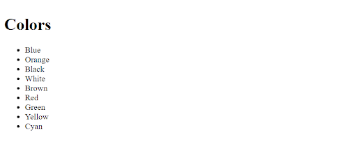
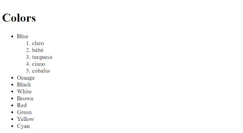
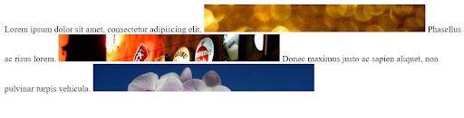

[Voltar](../main.md)

# Ficha PL HTML 01 - Elementos básicos

## Intro
Para uma introdução ao HTML: https://developer.mozilla.org/en-US/docs/Learn/HTML/Introduction_to_HTML/Getting_started

## Ex 0
Crie um documento HTML `ex0.html` dentro da pasta `Ficha-PL-1HTML-01-Elementos-basicos`.

Escreva a estrutura básica do HTML (head, body). 

Use elementos HTML para escrever um pequeno documento composto por:
1. título (`h1`)
2. um parágrafo (`p`)
3. uma secção (`h2`)
4. outro parágrafo (`h3`)

(Use o gerador de lorem ipsum para o texto dos parágrafos https://www.lipsum.com/)


## Ex 1
Edite o documento HTML `ex1.html` e crie uma estrutura semelhante à da Figura 1.  (Use o gerador de lorem ipsum para o texto dos parágrafos https://www.lipsum.com/)

Responda no documento `respostas.txt`:

1. Que elementos deve usar para o título do documento? 
2. E para cada uma das secções e sub-secções? 
3. E os parágrafos dentro das secções?
4. Qual o título da página no tab do browser? 
5. Como pode mudar o título que surge no tab/janela do browser? 
 

Figura 1.

## Ex 2
Crie uma cópia da sua solução do `Ex1` para o ficheiro `ex2.html` e altere-a de forma a colocar a primeira palavra de cada parágrafo em Itálico (Figura 2).

Leia a documentação https://developer.mozilla.org/en-US/docs/Web/HTML/Element/em para conhecer algumas alternativas de elementos para diferenciar palavras numa frase.
   
Responda no documento `respostas.txt`:
1. Qual a diferença entre os elementos `<i>` e `<em>`?


Figura 2

## Ex 3
Crie nova uma cópia da sua solução do `Ex1` para o ficheiro `ex3.html` e altere-a de forma a colocar a primeira letra de cada parágrafo a *bold* (Figura 3). 

Procure no site https://developer.mozilla.org/en-US/ informação sobre elementos que possa usar para este efeito.

Responda no documento `respostas.txt`:
1. Faz sentido a utilização destes elementos no contexto deste exercício?


Figura 3

## Ex 4
Cole o HTML seguinte no `<body>` do documento do ficheiro `ex4.html` (terá de escrever o resto do HTML do `<head>` e altere-o de forma a que cada frase esteja numa linha diferente (Figura 4).


```html
<h1>Lorem Ipsum</h1>
<p>Lorem ipsum dolor sit amet, consectetur adipiscing elit. Cras aliquet massa id enim posuere congue. Pellentesque venenatis lobortis libero at varius. Nullam sit amet sapien at arcu porta placerat eget sed metus. Interdum et malesuada fames ac ante ipsum primis in faucibus. Sed ac felis eu libero eleifend commodo. In at varius tellus. Vivamus at sollicitudin diam, sed consectetur ipsum. Proin maximus nisi est, nec porttitor est lacinia vel. Vivamus sagittis sed ante eget finibus. Ut euismod, libero vitae varius blandit, tortor est iaculis magna, ut lobortis arcu nisi eu mi. Cras tempus justo a purus dapibus faucibus. In hac habitasse platea dictumst. Suspendisse eleifend malesuada libero sit amet pretium.</p>
```


Figura 4

## Ex 5
Transforme as palavras seguintes numa lista HTML: `Blue Orange Black White Brown Red Green Yellow Cyan` (Figura 5.1).

- Adicione uma sub-lista à entrada “Blue” (Figura 5.2)

Responda no documento `respostas.txt`:
1. A lista da Figura 5.1 é uma lista ordenada (`<ol>`), ou uma lista não ordenada (`<ul>`)?



Figura 5.1



Figura 5.2

## Ex 6
Crie um novo documento HTML e insira três frases (podem ser lorem ipsum) e três imagens de 400 x 50 pixeis (descarregue três imagens aleatórias de https://picsum.photos/400/50). Faça _upload_ das imagens para a pasta `Ficha-PL-1HTML-01-Elementos-basicos` do seu Replit. Insira as frases e as imagens seguidas (Figura 6) dentro de um único parágrafo.

- Repare como as imagens ficam no fluxo do texto.


Figura 6


## Ex 7
Faça a previsualização da página `ex7.html` desta ficha. Use as ferramentas de desenvolvedor do seu browser para descobrir porque é que a imagem da página não carrega correctamente (Figura 7).

- Resolva o problema directamente na ferramenta de desenvolvedor.
- De seguida corrija o erro no documento `ex7.html` 


Figura 7

[Voltar](../main.md)