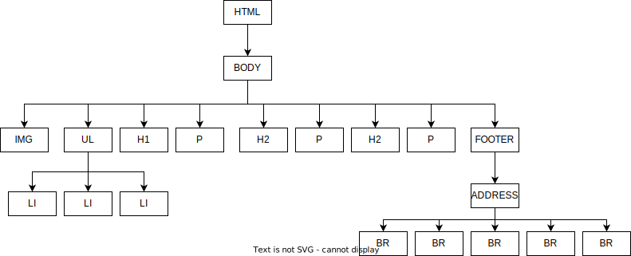
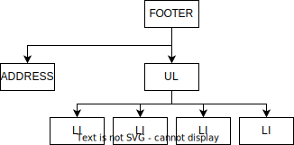

[Voltar](/1.begin.md)

# Ficha PL HTML 02 Hierarquia de elementos

## Intro
Para uma introdução ao HTML: https://developer.mozilla.org/en-US/docs/Learn/HTML/Introduction_to_HTML/Getting_started


## Ex 0
Analise o documento `ex0.html`. 

Desenhe no seu caderno ou computador, o diagrama em árvore dos elementos HTML desse documento.


## Ex 1

Experimente gerar o esqueleto de um documento HTML através de IA: 
- Abra o ficheiro `ex1.html` no Replit e escolha a opção _generate code with AI_ ou pressione `Ctrl+I`
- Escreva uma _prompt_ do género: `Gera o esqueleto de um documento HTML, em português Europeu, por favor.`
- Aceite o resultado e analise-o. Há algum elemento gerado que não compreenda? Peça esclarecimentos ao docente.


## Ex 2 

Observe o diagrama da Figura 1.


Figura 1

- O que representa o diagrama?
- Crie um documento no ficheiro `ex2.html` que tenha a estrutura de elementos HTML representada na Figura 1. Os elementos das folhas podem estar vazios (não precisa de adicionar conteúdo). Por exemplo para representar um dos `<li>` poderia simplesmente escrever `<li></li>`.

## Ex 3
Desenhe o diagrama da estrutura em árvore do HTML seguinte (não precisa de representar os atributos no diagrama, apenas os elementos tal como no diagrama do exercício anterior):
```html
<html lang="en">
<head>
<meta charset="UTF-8">
<title>TI - Ficha PL 3</title>
</head>
<body translate="no">
<div>
 
 <div>Titulo</div>
 <div>Descrição</div>
</div>

<div>
 
 <div>Título</div>
 <div>Descrição</div>
</div>

<div>
 
 <div>Título</div>
 <div>Descrição</div>
</div>
</body>
</html>
```

Pode desenhar o diagrama à mão em papel, ou nalgum software de desenho. 
- No final faça _upload_ da imagem (foto, screenshot, ou exportada) para o projecto com o nome `ex2-diagrama.jpg`.
- Crie um documento HTML no ficheiro `ex3.html` e insira a imagem usando o elemento ``.

## Ex 4
Ao diagrama que desenhou no Ex 3, acrescente a sub-árvore representada na Figura 3. 

- Pense primeiro onde deve ligar a sub-árvore da Figura 3, à árvore do seu diagrama inicial.
- Submeta a imagem resultante como `ex3-diagrama`.
- Traduza para HTML todo o diagrama resultante (pode aproveitar o HTML do `Ex3`) no documento `ex4.html`.


Figura 3

## Ex 5
Imagine que tinha de implementar uma estrutura HTML para a informação mostrada na Figura 4 (tirada de https://www.jn.pt/artes.html). 
- Que elementos contentores HTML usaria?
- Crie um documento HTML que ilustre a estrutura que usaria (use imagens fictícias). Não se preocupe com o aspecto visual, apenas com a estrutura interna da informação. Escreva o resultado no documento `ex5.html`.


Figura 4

[Voltar](/1.begin.md)