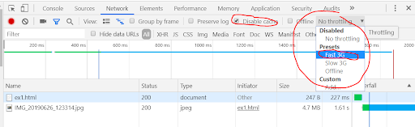
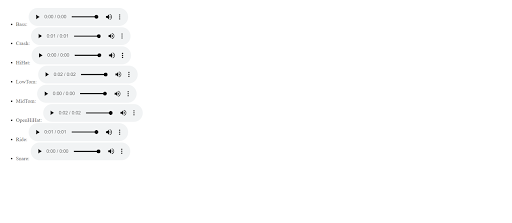

[Voltar](../main.md)

# Ficha PL HTML 03 - Elementos de media

## Intro
Para uma introdução ao HTML: https://developer.mozilla.org/en-US/docs/Learn/HTML/Introduction_to_HTML/Getting_started

Sobre elementos de media: https://developer.mozilla.org/en-US/docs/Learn/HTML/Multimedia_and_embedding

## Ex 0
Crie um documento HTML no ficheiro `ex0.html` e insira um elemento de imagem ``

- Verifique se a imagem é exibida na pré-visualização da página `ex0.html`
- Repare que o atributo `src` tem o valor `imagens/poster...`. O que acontece se remover a parte `imagens/` do `src`? Porquê?
- Para que serve o atributo `alt`? Leia em https://developer.mozilla.org/en-US/docs/Web/HTML/Element/img#accessibility
- Acrescente atributos `width="300"` e `height="200"`. O que acontece?

**Nota: Não deve usar os atributos `width` e `height` para alterar substancialmente a dimensão da imagem a exibir. Para isso deverá alterar fisicamente a imagem usando um editor de imagens.**

## Ex 1

1. Tire uma foto com o seu smartphone (ou utilize uma foto que já possua)
2. Transfira-a para o seu Replit (pasta `Ficha-PL-1HTML-03-Elementos-de-media/imagens`)
3. Inclua-a no documento HTML `ex1.html`.
1. Aponte o tamanho do ficheiro da imagem (abra o File Explorer ou Finder e verifique o tamanho do ficheiro de imagem)
   4. Aponte o tamanho no ficheiro `respostas.txt`
4. Use a ferramenta developer tools do Google Chrome para simular a visualização da página `ex1.html` através de um telemóvel com ligação 3G (veja a Figura 1 para saber como simular). 
   - Quanto tempo demora a carregar a página?
   - Aponte os valores no ficheiro `respostas.txt`

Figura 1

## Ex 2
Usando a mesma foto do Ex 1, use um editor de imagem (e.g., GIMP, ou PhotoShop) e crie três versões da foto, todas com 1200x900 píxeis e todas em formato JPG. Uma versão de alta qualidade, uma versão de média qualidade e uma versão de baixa qualidade. (_A qualidade é um parâmetro que pode controlar durante a exportação da imagem e normalmente consiste numa percentagem de compressão: quanto maior a compressão, menor a qualidade._)

1. Inclua as três fotos num novo documento HTML (`ex2.html`).
2. Responda ao seguinte no ficheiro `respostas.txt`:
     1. Use a ferramenta _developer tools_ do Google Chrome para simular a visualização da página através de um telemóvel com ligação 3G e meça os tempos de download de cada imagem.
     4. Quais das três versões acharia aceitável usar no seu site? Porquê?

## Ex 3
Copie o HTML do `ex2.html` para o `ex2.html`.
Valide o documento HTML `ex3.html` no serviço de validação de HTML (https://validator.w3.org/). (Para validar, pode usar a opção _Validate by Direct Input_ e copiar o HTML do `ex3.html` e colar no campo de texto do validador.)

1. Copie para o ficheiro `respostas.txt` os erros apontados pela ferramenta.
2. Se tiver dúvidas sobre os significados dos erros, pergunte ao docente.
3. Corrija os erros detectados.

## Ex 4
Crie um documento HTML (`ex4.html`) com duas imagens. 
- Use como _source_ das imagens um URL externo (e.g. de uma imagem do site da UC).
- Além disso, cada uma das imagens deve servir de link para o site da UC. Para usar uma imagem como link, basta colocá-la dentro do elemento `<a>`,por exemplo: ``
- Responda às questões no documento `respostas.txt`. 

1. Adicione um erro no URL de source de uma das imagens de forma a que o browser não a consiga carregar.
   - Qual o resultado visual?
2. Adicione o atributo `alt` com um texto descritivo na imagem com o erro no URL
   - Qual o resultado visual agora?
3. Na imagem sem erro no URL adicione o atributo `title`.
   - Qual o efeito deste atributo?

## Ex 5
Crie um novo documento HTML (`ex5.html`).
- Insira o vídeo (elemento `<video>`) `big_buck_bunny_480p_h264.webm` que encontra na pasta `videos`.
- Configure o vídeo de forma a que comece a reprodução automaticamente, mas sem possibilitar o controlo por parte do utilizador. (*Nota: devido às restrições de reprodução dos browsers, é possível que o vídeo não inicie automaticamente no seu browser. Se tal acontecer, adicione o atributo `muted` ao elemento `<video>`*)
- Insira depois um outro video (na mesma página) documento em que o vídeo não começa a reprodução automaticamente, permite que o utilizador controle a reprodução, e exibe uma imagem de poster (use a imagem `poster_rodents_bunnysize.jpg` que encontra na pasta `imagens`).

## Ex 6
Com os ficheiros de áudio disponíveis na pasta `audio`, crie um novo documento HTML (`ex6.html`) com uma lista não ordenada dos áudios de forma a que o utilizador consiga reproduzir cada um deles (Figura 5).

Figura 5

[Voltar](../main.md)