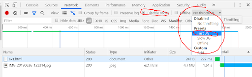

# Intro
You may want to read the following tutorials to learn about the basics of HTML: 

https://developer.mozilla.org/en-US/docs/Learn/HTML/Introduction_to_HTML/Getting_started

https://developer.mozilla.org/en-US/docs/Learn/HTML/Multimedia_and_embedding

# Ex 1  

Tire uma foto com o seu smartphone (ou utilize uma foto que já possua, em alta-resolução) e inclua-a no documento HTML `ex1.html`.

1. Aponte o tamanho do ficheiro de imagem (Mb)
2. Use a ferramenta developer tools do Google Chrome para simular a visualização da página através de um telemóvel com ligação 3G (veja a Figura 1 para saber como simular). 
   - Quanto tempo demora a carregar a página?
3. Aponte os valores no ficheiro `respostas.txt`

Figura 1

# Ex 2
Usando a mesma foto do Ex 1, use um editor de imagem (GIMP, ou PhotoShop) e crie três versões da foto, todas com 600x450 píxeis e todas em formato JPG. Uma versão de alta qualidade, uma versão de média qualidade e uma versão de baixa qualidade.

1. Inclua as três fotos num novo documento HTML (`ex2.html`).
2. Use a ferramenta developer tools do Google Chrome para simular a visualização da página através de um telemóvel com ligação 3G e meça os tempos de download de cada imagem.
3. Quais das três versões acharia aceitável usar no seu site? Porquê?

# Ex 3
Valide o documento HTML do Ex 2 no serviço de validação de HTML (https://validator.w3.org/).

1. Aponte no ficheiro `respostas.txt` os erros apontados pela ferramenta.
2. Copie o código para um novo documento (`ex3.html`).
3. Corrija nesse document (`ex3.html`) os erros detectados.

# Ex 4
Crie um documento HTML (`ex4.html`) com duas imagens. Use como source das imagens um URL externo (e.g. de uma imagem do site da UC). Além disso, cada uma das imagens deve servir de link para o site da UC. (Responda às questões no documento `respostas.txt`).

1. Adicione um erro no URL de source de uma das imagens de forma a que o browser não a consiga carregar.
   - Qual o resultado visual?
2. Adicione o atributo `alt` com um texto descritivo na imagem com o erro no URL
   - Qual o resultado visual agora?
3. Na imagem sem erro no URL adicione o atributo `title`.
   - Qual o efeito deste atributo?

# Ex 5
Crie um novo documento HTML (`ex5.html`) e insira o vídeo (elemento `<video>`) `movies/big_buck_bunny_480p_h264.webm` que encontra na pasta `videos`.
1. Configure o vídeo de forma a que comece a reprodução automaticamente, mas sem possibilitar o controlo por parte do utilizador. (*Nota: devido às restrições de reprodução dos browsers, é possível que o vídeo não inicie automaticamente no seu browser. Se tal acontecer, adicione o atributo `muted` ao elemento `<video>`*)
2. Insira depois um outro video (na mesma página) documento em que o vídeo não começa a reprodução automaticamente, permite que o utilizador controle a reprodução, e exibe uma imagem de poster (use a imagem `poster_rodents_bunnysize.jpg` que encontra na pasta `imagens`).

# Ex 6
Com os ficheiros de áudio disponíveis na pasta `audio`, crie um novo documento HTML (`ex6.html`) com uma lista não ordenada dos áudios de forma a que o utilizador consiga reproduzir cada um deles (Figura 5).

Figura 5