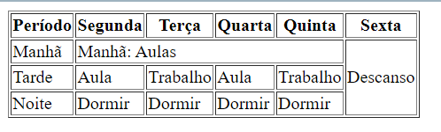

[Voltar](/.tutorial/1.begin.md)
# Ficha HTML 05 - Tabelas

## Intro  
As tabelas HTML são uma maneira fundamental de organizar e exibir dados num formato estruturado numa página da web. Permitem criar linhas e colunas de conteúdo, facilitando a apresentação de informações de maneira clara e organizada. Nesta ficha, abordaremos o básico para criar e usar tabelas HTML.

Para criar uma tabela HTML básica, deve usar os elementos `<table>`, `<tr>` e `<td>`.

`<table>`: Este é o contentor principal para a tabela.
`<tr>`: Significa linha da tabela (_table row_) e define uma linha dentro da tabela.
`<td>`: Significa dados da tabela (_table data_) e define uma célula dentro de uma linha.

Aqui está um exemplo de uma tabela simples com duas linhas e duas colunas:

```html
<!DOCTYPE html>
<html>
<head>
  <title>Exemplo de Tabela Simples</title>
</head>
<body>
  <table border="1">
    <tr>
      <td>Linha 1, Célula 1</td>
      <td>Linha 1, Célula 2</td>
    </tr>
    <tr>
      <td>Linha 2, Célula 1</td>
      <td>Linha 2, Célula 2</td>
    </tr>
  </table>
</body>
</html>
```

## Ex 1
Crie uma tabela com 3 linhas e 2 colunas. Na primeira coluna, insira os meses do ano (janeiro, fevereiro, março). Na segunda coluna, insira o número correspondente ao mês (1, 2, 3).


## Ex 2

### Adicionando Cabeçalhos à Tabela
Pode usar o elemento `<th>` para definir cabeçalhos para colunas ou linhas. Os cabeçalhos geralmente são em negrito e centralizados.

```html
<!DOCTYPE html>
<html>
<head>
  <title>Tabela com Cabeçalhos</title>
</head>
<body>
  <table border="1">
    <tr>
      <th>Coluna 1</th>
      <th>Coluna 2</th>
    </tr>
    <tr>
      <td>Linha 1, Célula 1</td>
      <td>Linha 1, Célula 2</td>
    </tr>
    <tr>
      <td>Linha 2, Célula 1</td>
      <td>Linha 2, Célula 2</td>
    </tr>
  </table>
</body>
</html>
```

Modifique a tabela do exercício anterior para incluir cabeçalhos para as colunas: "Mês" para a primeira coluna e "Número" para a segunda coluna.

## Ex 3
### Ajustando Linhas ou Colunas
Pode estender várias linhas ou colunas dentro de uma tabela usando os atributos `rowspan` (para linhas) e `colspan` (para colunas). Isto é útil para criar células fundidas.

```html
<!DOCTYPE html>
<html>
<head>
  <title>Extensão de Linhas e Colunas</title>
</head>
<body>
  <table border="1">
    <tr>
      <td>Linha 1, Célula 1</td>
      <td colspan="2">Estendendo duas colunas (Linha 1, Células 2, 3)</td>
     
    </tr>
    <tr>
      <td rowspan="2">Estendendo duas linhas (Linha 2,3 Célula 1)</td>
      <td>Linha 2, Célula 2</td>
       <td>Linha 2, Célula 3</td>
    </tr>
    <tr>
      <td>Linha 3, Célula 2</td>
       <td>Linha 3, Célula 3</td>
    </tr>
  </table>
</body>
</html>
```

Crie uma nova tabela como a da Figura 3. Use `<th>`, `rowspan` e `colspan` na sual solução.



Figura 3


## Conclusão
As tabelas HTML são uma ferramenta poderosa para estruturar e exibir dados numa página web. 

É importante enfatizar que as tabelas devem ser usadas principalmente para apresentar dados tabulares ou organizar conteúdo de maneira significativa. **Não devem ser usadas para layout ou formatação, pois isso é melhor alcançado usando CSS (Cascading Style Sheets).** 

Utilizar tabelas para layout é considerado desatualizado e não está em conformidade com os padrões modernos de desenvolvimento web. Em vez disso, use CSS para estilizar e formatar seu conteúdo, garantindo a separação de preocupações e melhor acessibilidade e manutenibilidade.

[Voltar](/.tutorial/1.begin.md)