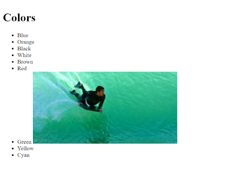
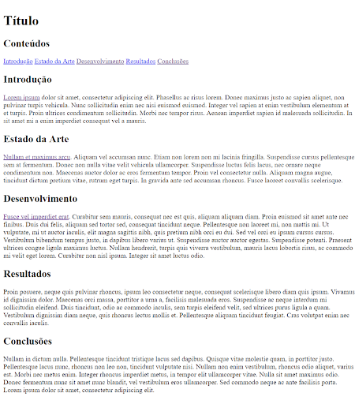

# Intro
You may want to read the following tutorial to learn about the basics of HTML: https://developer.mozilla.org/en-US/docs/Learn/HTML/Introduction_to_HTML/Getting_started

# Ex 1
Um documento HTML com estrutura e conteúdo conforme observado na Figura 1.1. Pode descarregar a imagem de https://picsum.photos/400/200/.

- Coloque a imagem associada a um ponto da lista (Figura 1).
- Valide o seu HTML usando o serviço https://validator.w3.org/

1. Que atributos são fundamentais no elemento ``? Responda num ficheiro chamado "respostas.txt".

Figura 1

# Ex 2
Crie um novo documento com a estrutura e conteúdos como na Figura 2. Pode usar lorem ipsum para os parágrafos de texto (https://www.lipsum.com/). Estruture correctamente o documento com os elementos apropriados. 
- Na secção “Conteúdos”, crie links internos para cada uma das secções do documento.
- Na secção “Introdução” use as primeiras duas palavras como link para a página “http://uc.pt”
- Na secção “Estado da Arte”, use a primeira frase como link para a página “http://uc.pt”, mas de forma a que abra num tab novo.
- Na secção “Desenvolvimento”, use a primeira frase como link para a sua solução do Ex 1.
- Transforme a sequência de links da secção “Conteúdos” numa lista ordenada.

Figura 2

# Ex 3
Observe a Figura 3 com um screenshot da página principal do site da Universidade de Coimbra. 

- Crie uma página com os elementos estruturais principais dessa página.
  - Considere primeiro os grandes elementos semânticos estruturais.
  - Considere depois a lista de notícias e eventos. Considere os elementos como uma hierarquia de blocos e modele essa hierarquia com elementos contentores HTML. 

Figura 3
