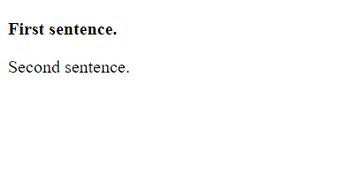
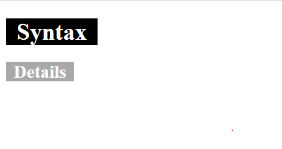

# Intro
You may want to read the following tutorial to learn about the basics of CSS: 

https://developer.mozilla.org/en-US/docs/Learn/CSS

--- 

**Estruture a suas soluções em pastas para cada exercício. É fornecido um exemplo para o Ex 1.**

--- 

# Ex 1

Crie um novo documento HTML e copie o código seguinte para o corpo do documento. Associe uma folha de estilos CSS e, sem modificar o HTML, aplique um estilo ao elemento <span> de forma a conseguir o resultado da Figura 1.

```html
<p>There is a very <span>important</span> word in this sentence</p>
```

---

Figura 1
___ 

# Ex 2
Crie um novo documento HTML e copie o código seguinte para o corpo do documento. Associe uma folha de estilos CSS e, sem modificar o HTML, aplique um estilo de forma a colocar a primeira frase a bold.

```html
<div id="first">
	<p>First sentence.</p>
</div>
<div>
	<p>Second sentence.</p>
</div>
```

---

Figura 2
___ 


# Ex 3

Crie um novo documento HTML e copie o código seginte para o corpo do documento. Associe uma folha de estilos CSS. Usando apenas selectores de elemento ou combinações de selectores de elemento, tente emular o resultado (pode alterar o HTML ligeiramente, se não conseguir de outra forma).

```html
<h1><span>Syntax</span></h1>

<h2><span>Details</span></h2>
```

---

Figura 3
___ 


# Ex 4
Crie um novo documento HTML e copie o código seguinte para o corpo do documento. Associe uma folha de estilos CSS. 
- Aplique estilos CSS para emular o resultado da Figura 4.
   - Note que o HTML já tem classes associadas aos parágrafos.
- Pense sobre qual o melhor selector CSS para garantir flexibilidade do código.

```html
<p class="note">Note: Lorem ipsum dolor sit amet, consectetur adipiscing elit...</p>

<p class="warning">Warning: Etiam ultricies varius justo, sit amet elementum ligula commodo...</p>

<p class="error">Error: Nam vel aliquet dolor. In est tellus, gravida condimentum est ut, gravida finibus urna...</p>

<p>Etiam urna turpis, imperdiet at ante et, iaculis porta nisl... </p>

<p>Curabitur venenatis facilisis erat id convallis... </p>
```

---

Figura 4
___ 

# Ex 5
Menus horizontais podem ser criados de muitas formas. Neste exercício usamos uma técnica que consiste numa sequência de elementos `<span>` distribuídos horizontalmente.

Tente atingir o resultado da Figura 5. 
- Crie um novo documento HTML e copie o código seguinte para o corpo do documento.
- Associe uma folha de estilos CSS e copie o CSS seguinte para o documento.
- Parte do trabalho está feito no CSS. Implemente o resto do código CSS (cores de fundo, reagir ao “hover” e “active” pseudo-classes, centrar o texto, etc. Pode precisar das seguintes propriedades CSS:
  - `line-height`
  - `text-decoration`
  - `font-size`
  - `color`

HTML:
```html
<nav>
  <span><a href="#">Home</a></span><span><a href="#">Products</a></span><span><a hreF="#">Pricing</a></span><span><a href="#">Help</a></span>
</nav>
```

CSS:
```css
nav>span {
   display: inline-block;
   width: 20%;

   margin-right: calc(20% / 3);
}
nav>span:last-child {
   margin-right: 0;
}
```

---

Figura 5 - https://ti-ficha-pl--jorgecardoso.repl.co/pl-5/ex5.html
___ 

# Ex 6
Crie um novo documento HTML e copie o código seguinte para o corpo do documento. Associe uma folha de estilos CSS. Modifique o CSS do Ex 5 de forma a replicar o layout do Ex 5, mas sobre uma estrutura HTML baseada numa lista.

- Para facilitar, aplique `display: inline-block;` aos `<li>`

HTML:
```html
<nav>
<ul>
 <li><a href="#">Home</a></li><li><a href="#">Products</a></li><li><a hreF="#">Pricing</a></li><li><a href="#">Help</a></li>
</ul>
</nav>
```

---

Figura 6 - https://ti-ficha-pl--jorgecardoso.repl.co/pl-5/ex6.html
___ 
