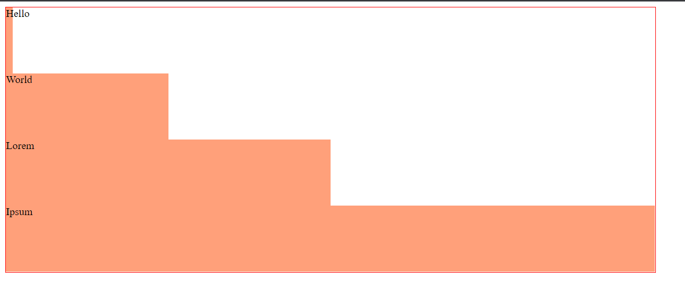

[Voltar](/.tutorial/1.begin.md)
# Ficha PL CSS - Unidades

## Intro
Para uma introdução ao CSS: https://developer.mozilla.org/en-US/docs/Learn/CSS

--- 

**Estruture a suas soluções em pastas para cada exercício. Para cada exercício deve criar uma pasta (`ex1`, `ex2`, `ex3`, etc.) e colocar dentro dessa pasta um ficheiro html (`ex1.html`, `ex2.html`, `ex3.html`, etc.) e outros ficheiros necessários (por exemplo, CSS). É fornecido um exemplo para o Ex 1.**

__Use o preview em novo tab para verificar o seu trabalho. Não use o preview embebido no editor uma vez que este tem bugs.__

--- 


## Ex 1

Observe o conteúdo e resultado dos ficheiros na pasta `ex1`.
No ficheiro `ex1.css`, sem modificar o código existente, adicione regras de forma a recriar o efeito de escada da Figura 1.
- A `<div>` _Hello_ deve ter 15px de largura
-  A `<div>` _World_ deve ter 240px de largura
-   A `<div>` _Lorem_ deve ter 490px de largura
-    A `<div>` _Ipsum_ deve ter 980px de largura

---

Figura 1
___ 

## Ex 2
Nos ficheiros da pasta `ex2` reproduza o mesmo resultado do Ex1, mas agora de forma a que a largura das `<div>` dentro do `<header>` acompanhem a largura deste, à medida que a janela é redimensionada. **Use percentagens nas unidades das regras CSS**

## Ex 3
Reproduza mais uma vez o resultado do Ex1, mas agora usando as unidades `vw`. 


## Ex 4
Observe o conteúdo e resultado dos ficheiros na pasta `ex4`.
No ficheiro `ex4.css` adicione declarações à regra `div`  de forma a que as duas `<div>` ocupem metade da largura do `<header>` e metade da altura 
```css
div {
  display: inline-block;
  background-color: lightblue; 
  
  /* adicione a seguir declarações*/
  
}
```

**As `<div>` devem ter sempre metade da largura do `<header>`, qualquer que seja a largura da janela**


## Ex 5
Copie o resultado do `Ex4` para a pasta `ex5` fazendo os ajustes necessários aos nomes dos ficheiros e suas ligações.

- Adicione ao ficheiro CSS regras para:
  1. Definir o tamanho default do texto da página em 20pt;
  2. Definir o tamanho do texto da `<div>` _Hello_  como o dobro do tamanho default.
  3. Definir o tamanho do texto da `<div>` _World_  como o 1.5 vezes o tamanho default.

__Use unidades relativas__

[Voltar](/.tutorial/1.begin.md)