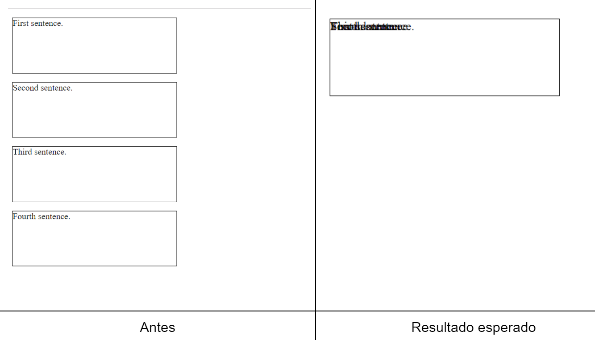
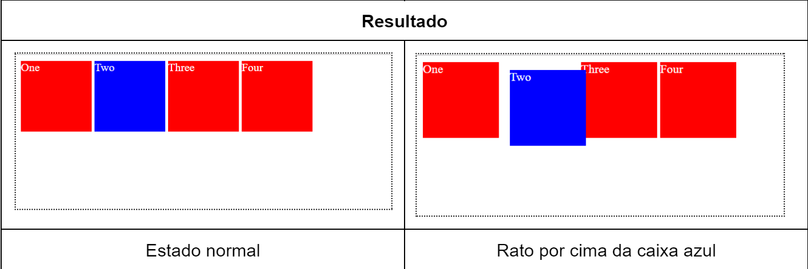
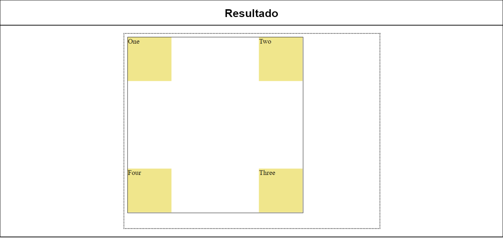
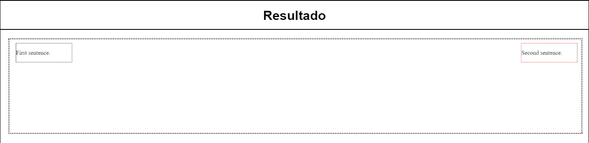
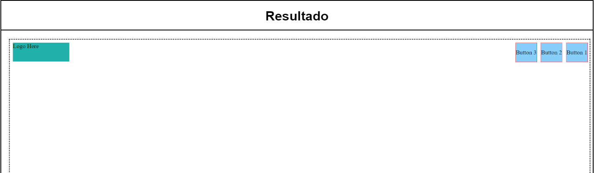

[Voltar](/.tutorial/1.begin.md)
# Ficha PL CSS - Posicionamento

## Intro
Para uma introdução ao CSS: https://developer.mozilla.org/en-US/docs/Learn/CSS

--- 

**Estruture a suas soluções em pastas para cada exercício. Para cada exercício deve criar uma pasta (`ex1`, `ex2`, `ex3`, etc.) e colocar dentro dessa pasta um ficheiro html (`ex1.html`, `ex2.html`, `ex3.html`, etc.) e outros ficheiros necessários (por exemplo, CSS). É fornecido um exemplo para o Ex 1.**

__Use o preview em novo tab para verificar o seu trabalho. Não use o preview embebido no editor uma vez que este tem bugs.__

--- 


# Ex 1

Crie um novo documento HTML e copie o código seguinte para o corpo do documento. 

```html 
<p>First sentence.</p>

<p>Second sentence.</p>

<p>Third sentence.</p>

<p>Fourth sentence.</p>
```

Associe uma folha de estilos CSS e copie o seguinte código para lá:
```css
p {
 outline: 1px solid black;
 height: 100px;
 width: 300px;
}
```

- Sem modificar o HTML, adicione ao CSS fornecido as regras CSS para reproduzir o resultado da Figura 1: todos os parágrafos devem ficar sobrepostos. Use obrigatoriamente **posicionamento relativo** nos `<p>`. **Atenção: Posicionamento relativo não é a forma mais prática de obter o resultado, mas é um bom treino!**


---

Figura 1
___ 


# Ex 2
Crie um novo documento HTML (`ex2.html` dentro da pasta `ex2`) e copie o código seguinte para o corpo do documento:
```html
 <div class="box" id="one">One</div>
 <div class="box" id="two">Two</div>
 <div class="box" id="three">Three</div>
 <div class="box" id="four">Four</div>
 ```
 
 Associe uma folha de estilos CSS e copie o seguinte código para essa folha:
 ```css
 .box {
   display: inline-block;
   width: 100px;
   height: 100px;
   background: red;
   color: white;
}

```

- Sem modificar o HTML, adicione ao CSS fornecido as regras CSS para reproduzir o resultado da Figura 2: a caixa azul deve mover-se ligeiramente para a direita e para baixo quando o rato passa por cima. Responda às seguintes questões no ficheiro `respostas.txt`
  - Que posicionamento é mais adequado neste caso?
  - Para que serve a propriedade “display: inline-block”?
---

Figura 2
___ 

# Ex 3
Crie um novo documento HTML (`ex3.html` dentro da pasta `ex3`) e copie o código seguinte para o corpo do documento:
```html
<div class="container">
 <div class="box" id="one">One</div>
 <div class="box" id="two">Two</div>
 <div class="box" id="three">Three</div>
 <div class="box" id="four">Four</div>
</div>
```

Associe uma folha de estilos CSS copie o código seguinte:
```css
.container {
 width: 400px;
 height: 400px;
 position: relative;
 border: 1px solid black;
}
```

- Sem modificar o HTML, adicione ao CSS fornecido as regras CSS para reproduzir o resultado da Figura 3. As regras a escrever referem-se apenas às `<div>` interiores (com classe `box`). Responda às seguintes questões no ficheiro `respostas.txt`
  - Que posicionamento é mais adequado neste caso?
  - Porque é que a `<div>` “container” precisa da propriedade `position: relative`?
---

Figura 3
___ 

# Ex 4
Crie um novo documento HTML e copie o código seguinte para o corpo do documento:
```html
<div id="first">
   <p>First sentence.</p>
</div>
<div id="second">
   <p>Second sentence.</p>
</div>
```

Associe uma folha de estilos CSS e, sem modificar o HTML, escreva as regras CSS para fazer com que:
- a primeira `<div>` tenha
   - 150 píxeis de largura,
   - borda preta e
   - esteja posicionada a 10 píxeis do topo e 10 píxeis do lado esquerdo da janela.
 - a segunda `<div>` deve ter
   - 150 píxeis de largura,
   - borda vermelha e
   - estar posicionada a 10 píxeis do topo e 10 píxeis do lado direito da janela.

---

Figura 4
___ 

# Ex 5
Crie um novo documento HTML e copie o código seguinte para o corpo do documento:
```html
<header>
  <div class="logo">
   Logo Here
  </div>
  <div class="menu">
   <span class="menuitem">Button 1</span>
   <span class="menuitem">Button 2</span>
   <span class="menuitem">Button 3</span>
  </div>
</header>

```

Associe uma folha de estilos CSS e, sem modificar o HTML, aplique os estilos que reproduzem o resultado da Figura 5.

---

Figura 5
___ 


[Voltar](/.tutorial/1.begin.md)