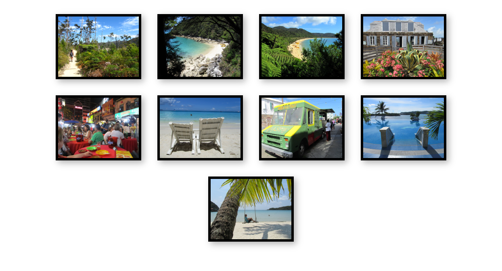
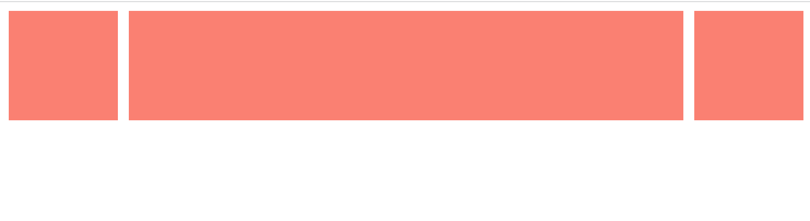
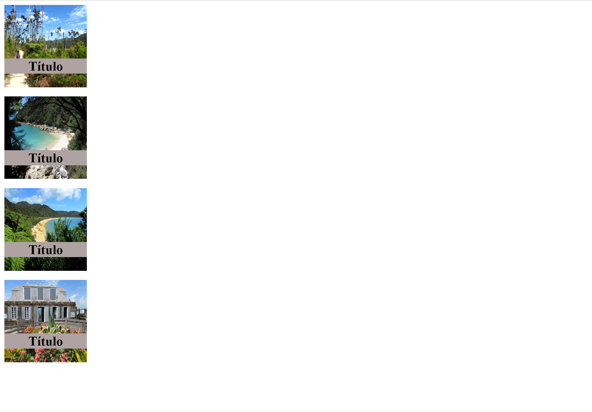

[Voltar](/.tutorial/1.begin.md)
# Ficha PL CSS - Flexbox

## Intro
Para uma introdução ao CSS: https://developer.mozilla.org/en-US/docs/Learn/CSS

--- 

**Estruture a suas soluções em pastas para cada exercício. Para cada exercício deve criar uma pasta (`ex1`, `ex2`, `ex3`, etc.) e colocar dentro dessa pasta um ficheiro html (`ex1.html`, `ex2.html`, `ex3.html`, etc.) e outros ficheiros necessários (por exemplo, CSS). É fornecido um exemplo para o Ex 1.**

__Use o preview em novo tab para verificar o seu trabalho. Não use o preview embebido no editor uma vez que este tem bugs.__

--- 

# Ex 1

Observe o conteúdo e resultado dos ficheiros na pasta `ex1`.
No ficheiro `ex1.css`, sem modificar o código existente, use `display: flex` e configure para que as imagens fiquem sempre centradas horizontalmente na janela, qualquer que seja a largura da janela. 

Nota: o número de imagens por linha pode variar consoante a largura da janela.

Figura 1

# Ex 2
Observe o conteúdo e resultado dos ficheiros na pasta `ex2`.
Adicione regras `flexbox` de forma a que o item central se expanda de acordo com a largura da janela.

Figura 2

# Ex 3
Observe o conteúdo e resultado dos ficheiros na pasta `ex3`.
Modifique o ficheiro `ex3.css`:
- Comece por fazer com que o título de cada imagem se sobreponha à mesma.
- Aplique depois regras `flexbox` ao `<aside>` de forma a que as imagens sejam apresentadas numa coluna vertical.
  

Figura 3

[Voltar](/.tutorial/1.begin.md)