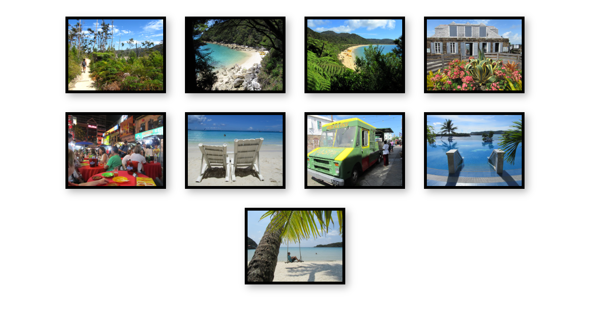
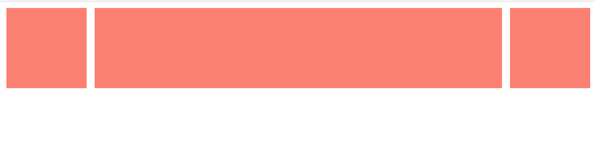
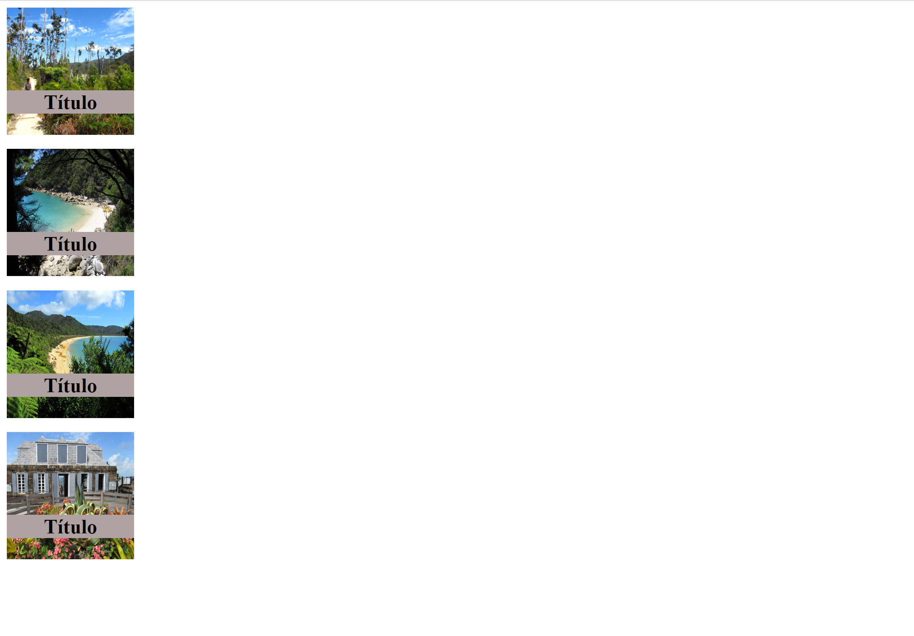

# Intro
You may want to read the following tutorial to learn about the basics of CSS: 

https://developer.mozilla.org/en-US/docs/Learn/CSS

__Estruture a suas soluções em pastas para cada exercício.__

__Use o preview em novo tab para verificar o seu trabalho. Não use o preview embebido no editor.__

--------

# Ex 1

Observe o conteúdo e resultado dos ficheiros na pasta `ex1`.
No ficheiro `ex1.css`, sem modificar o código existente, use `display: flex` e configure para que as imagens fiquem sempre centradas horizontalmente na janela, qualquer que seja a largura da janela. 

Nota: o número de imagens por linha pode variar consoante a largura da janela.

Figura 1

# Ex 2
Observe o conteúdo e resultado dos ficheiros na pasta `ex2`.
Adicione regras `flexbox` de forma a que o item central se expanda de acordo com a largura da janela.

Figura 2

# Ex 3
Observe o conteúdo e resultado dos ficheiros na pasta `ex3`.
Modifique o ficheiro `ex3.css`:
- Comece por fazer com que o título de cada imagem se sobreponha à mesma.
- Aplique depois regras `flexbox` ao `<aside>` de forma a que as imagens sejam apresentadas numa coluna vertical.
  

Figura 3