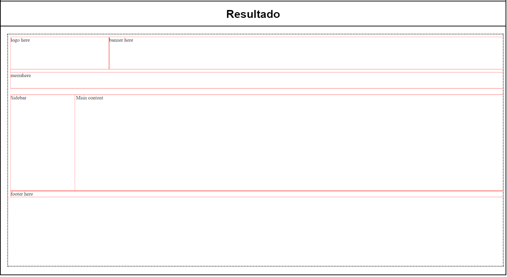
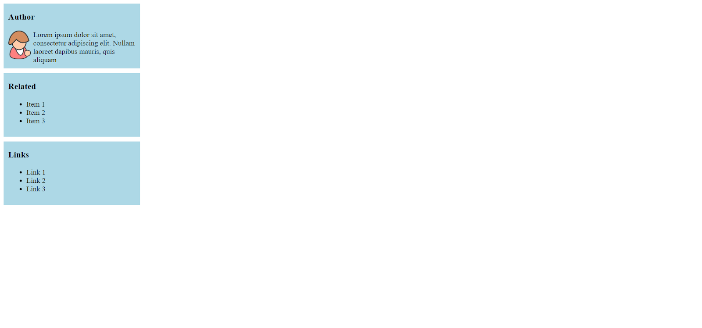

[Voltar](/.tutorial/1.begin.md)
# Ficha PL CSS - Exercícios-chave

## Ex 1
Crie um novo documento HTML e associe uma folha de estilos CSS. Escreva a estrutura HTML e aplique os estilos CSS que reproduzem o resultado da Figura 1.

---

Figura 1
___ 

## Ex 2
Crie um novo documento HTML e copie o código seguinte para o corpo do documento. Associe uma folha de estilos CSS. Complete o código CSS fornecido, de forma a que cada “cartão” tenha um fundo azul claro e padding e margens apropriadas entre cartões.

HTML:
```html
<aside>
<div class="card">
 <h3>Author</h3>
  Lorem ipsum dolor sit amet, consectetur adipiscing elit. Nullam laoreet dapibus mauris, quis aliquam
</div>
<div class="card">
 <h3>Related</h3>
 <ul>
  <li>Item 1</li>
  <li>Item 2</li>
  <li>Item 3</li>
 </ul>
</div>
<div class="card">
 <h3>Links</h3>
<ul>
  <li>Link 1</li>
  <li>Link 2</li>
  <li>Link 3</li>
 </ul>
</div>
</aside>
```

CSS:
```css
aside {
   width: 20%;
   min-width: 200px;
   max-width: 300px;
}
.float {
   float:left;
   margin-right:5px;
}
```

---

Figura 7 
___ 


[Voltar](/.tutorial/1.begin.md)