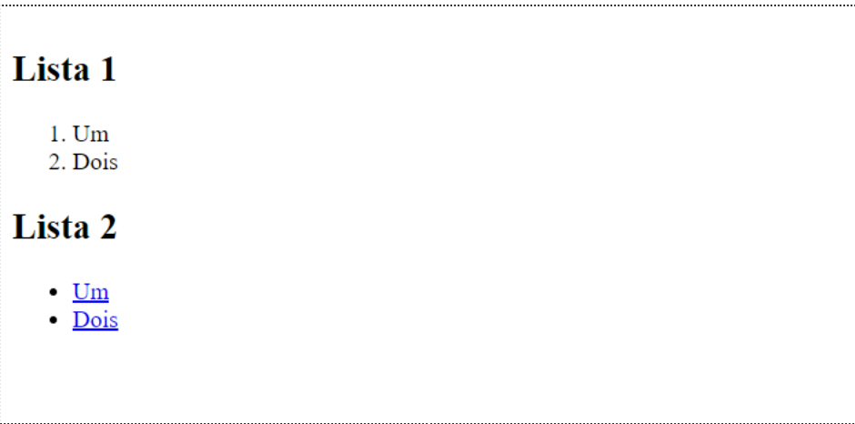

# Intro


__Estruture a suas soluções em pastas para cada exercício.__

__Use o preview em novo tab para verificar o seu trabalho. Não use o preview embebido no editor.__

--------


# Ex 1
Crie uma função JavaScript, com nome `addLi`, que adicione um elemento de lista `<li>` a uma lista. A lista deve ser passada como um parâmetro na forma de selector CSS, o valor do novo elemento deve também ser passado.
Use a sua função sobre o HTML da pasta `ex1` da seguinte forma:

```javascript
addLi("ol", "Dois");
addLi("ul", "<a href='#'> Dois </a>");
```

O resultado deverá ser semelhante ao apresentado na Figura 1.


Figura 1


# Ex 2
Implemente o código do script `ex2.js`, de forma a emular o comportamento exemplificado aqui: https://ti-ficha-pl--jorgecardoso.repl.co/pl-9/ex4.html


# Ex 3
Observe o código JavaScript do ficheiro `ex3.js` que faz uma chamada à API RandomUser. A chamada retorna dados de dois utilizadores aleatórios.

Escreva o resto do código para converter o resultado em HTML mostrado no documento HTML:
1. Comece por inspecionar o objecto que resulta da chamada na consola JavaScript e perceba a sua estrutura.
2. Escreva uma função que converte um objecto em HTML (sugestão: ver Ex 2 ficha JavaScript 02).
3. Use essa função para adicionar o HTML ao documento.