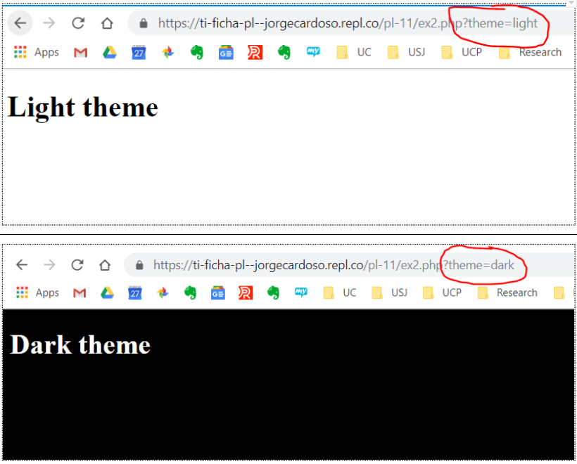

[Voltar](../main.md)
# Ficha PL PHP

## Intro

**Estruture a suas soluções em pastas para cada exercício. Para cada exercício deve criar uma pasta (`ex1`, `ex2`, `ex3`, etc.) e colocar dentro dessa pasta um ficheiro html (`ex1.html`, `ex2.html`, `ex3.html`, etc.) e outros ficheiros necessários (por exemplo, CSS).**

__Use o preview em novo tab para verificar o seu trabalho. Não use o preview embebido no editor uma vez que este tem bugs.__

--- 


# Ex 1

Escreva um script PHP (o ficheiro `ex1.php` já está parcialmente escrito) que gere um documento HTML com um `<h1>` no `<body>`. O conteúdo do `<h1>` deve ser “Lorem” ou “Ipsum” dependendo do valor de um número aleatório: se o número aleatório gerado entre 0 e 100 for inferior a 50, o valor do `<h1>` deverá ser “Lorem”, caso contrário deverá ser “Ipsum”.

Para ajudar, considere o seguinte código, que gera um número aleatório e o compara com `50`: 

```php
$randValue = mt_rand(0, 100);

if ($randValue < 50) {
  
} else {
  
}

```

Veja nos slides como _escrever_ código HTML através do PHP (ver `echo`).

* Caso necessário, consulte a documentação da função mt_rand(): https://www.php.net/manual/en/function.mt-rand.php

# Ex 2
Escreva um script PHP que ajude a criar uma página em que o utilizador pode escolher o _tema_ visual (esquema de cores):

* Se o valor do parâmetro do URL `theme` for `light` (`?theme=light`), deve devolver uma página com uma folha de estilos de tema claro;
* Se o valor de `theme` for `dark`, deve devolver uma página com uma folha de estilos de tema escuro.
* Para além disso, deve escrever um `<h1>` com o nome do tema, como exemplificado na Figura 2.

  
Para obter este resultado, deve implementar dois ficheiros CSS: um para o tema claro, outro para o tema escuro (a pasta `ex2` inclui já os dois ficheiros `.css` com regras básicas para alterar o esquema de cores do fundo do `<body>` e do texto. 

O PHP deverá decidir qual dos dois associar ao HTML, isto é, deverá gerar o elemento `<link>`

Para *ler* os parâmetro `theme` do URL, use o seguinte:
```php

$tema = $_GET['theme'];

```


Figura 2

# Ex 3
Identifique e corrija os erros no script PHP seguinte:
```php
<?php

age1 = 3;

if (age1 < 18) {
  echo "Sorry, you must be 18 or older to access this site.";
}

?>
```

# Ex 4
Escreva um script PHP que gere um documento HTML com um título escolhido aleatoriamente de entre um conjunto pré-definido de títulos:

1. Crie um array com um conjunto de strings para os títulos
2. Use a função mt_rand() para gerar um índice aleatório sobre o array
3. Faça output da string correspondente à posição do índice gerado no array


# Ex 5
Crie um script PHP para contar o número de visitas a uma página:
1. O script deve começar por ler o número de visitas actuais guardado num ficheiro de texto (crie manualmente este ficheiro, primeiro)
2. De seguida, incrementa o número lido
3. Grava o novo número no mesmo ficheiro de texto
4. Finalmente, faz output do resultado na página HTML


**Use as funções file_get_contents() e file_put_contents()** 

# Ex 6
Crie uma página com um formulário de login (username e password). 
* Crie um script PHP para receber os dados do formulário e comparar com um username e password pré-definidos (hard-coded no script PHP).
* Se ambos username e password coincidirem com os pré-definidos, o script deve escrever “Podes entrar”, caso contrário deve escrever “Não podes passar!”.
* Garanta que os dados do formulário são enviados através do método POST.

# Ex 7
Crie um formulário de contacto numa página e aplique a técnica de gravar os dados para ficheiros como discutido na aula teórica.


[Voltar](../main.md)