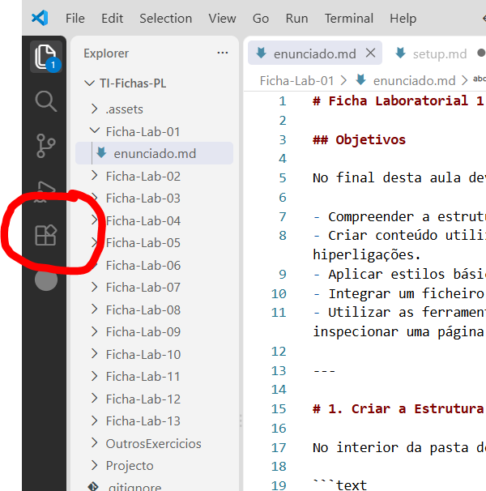
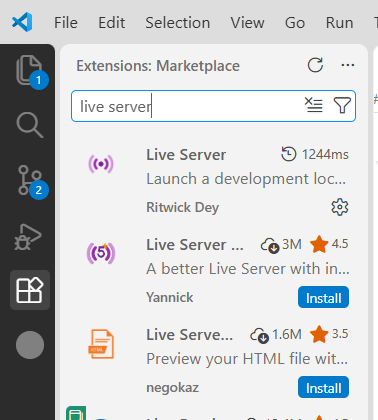
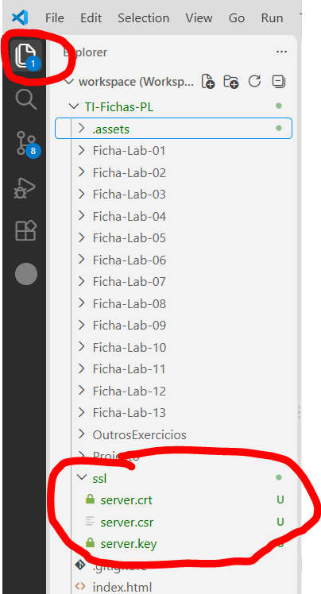
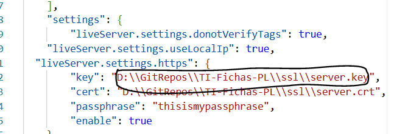
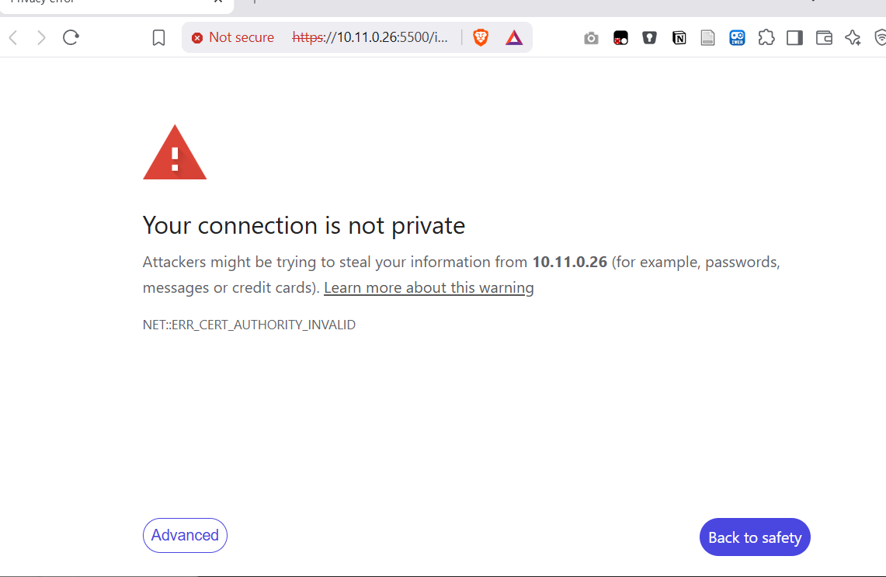
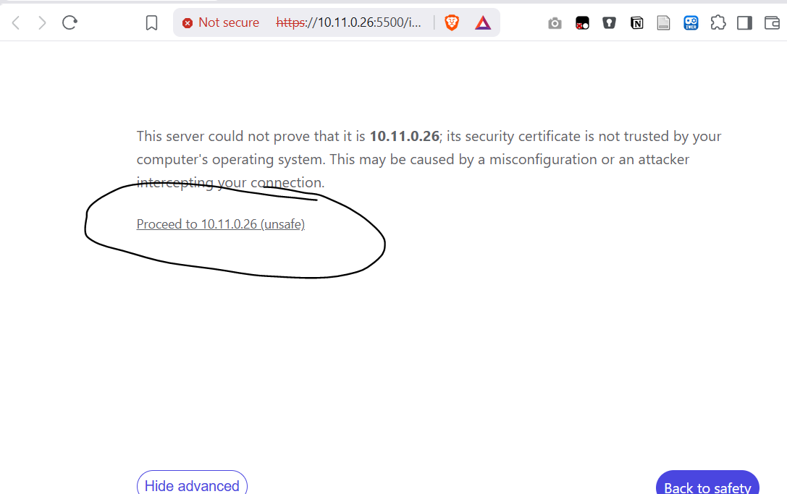
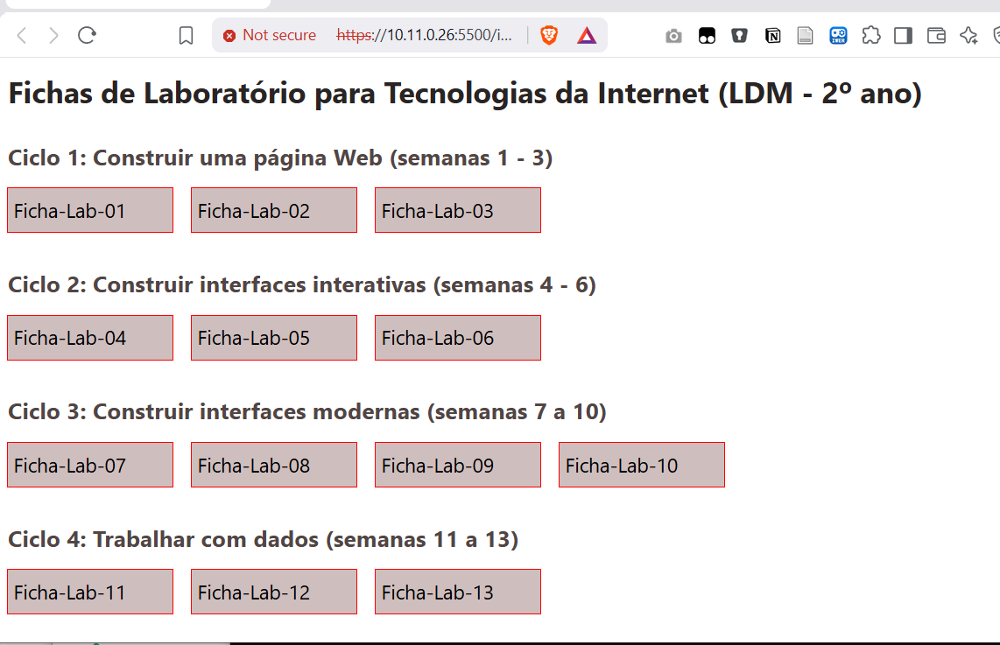

# TI-Fichas-PL - Configuração do ambiente de trabalho

## 1. Instalar o VSCode
1. Aceda a https://code.visualstudio.com/ 
2. Descarregue e instale a última versão do Visual Studio Code (VSCode) para o seu computador
3. Abra o VSCode e avance com a configuração default


## 2. Instalar a extensão Live Server
A funcionalidade do VSCode pode ser estendida através de _Extensões_. Nesta unidade, vamos usar a extensão `Live Server` que executa um servidor web local no VSCode.

1. Localize o ícone do painel de extensões

2. Na barra de pesquisa escreva _Live Server_

3. Clique no botão _Install_ (na imagem o botão não aparece porque a extensão já havia sido instalada)


## 3. Instalar a extensão IAEdu
Repita os passos anteriores e instale a extensão _IAEdu_


## 4. Criar repositório local com as fichas de laboratório
1. Escolha ou crie no seu computador uma pasta __dentro da qual__ se irá colocar a pasta das fichas e projeto de Tecnologias da Internet
    * __Nota:__ O caminho completo desta pasta não deverá ter caracters acentuados, cedilhas, nem espaços (idealmente)
2. Abra essa pasta com o VSCode (`File -> Open Folder`).
2. Abrir o terminal do VSCode (`Terminal -> New Terminal`)
3. No terminal, execute os seguintes comandos um de cada vez:
```bash
git clone --depth 1 https://github.com/jorgecardoso/TI-Fichas-PL.git
```
__Atenção:__ A palavra `Nome` nos comandos seguintes deverá ser substituída pelo seu nome (e.g., Primeiro e Último nomes)
```bash
mv TI-Fichas-PL TI-Fichas-PL-Nome
```
```bash
cd TI-Fichas-PL-Nome
```
```bash
git remote rename origin upstream  
```

## 5. Abrir a pasta no VSCode
1. `File->Open Workspace from file` e seleccione o ficheiro `workspace.code-workspace` que está dentro da pasta `TI-Fichas-PL-Nome` que acabou de criar no passo anterior.

## 6. Configurar o acesso seguro (HTTPS) do servidor local
1. Abrir o painel _Explorer_ do VSCode e depois expandir a pasta `ssh`:

2. Abrir o ficheiro `workspace.code-workspace` no editor clicando uma vez no nome do ficheiro.
3. Clicar com o botão direito do rato sobre o ficheiro `server.key`, que está dentro da pasta `ssh`, e escolher a opção `Copy Path`
4. No documento `workspace.code-workspace` substitua o caminho do campo `key` fazendo paste do caminho que copiou no passo anterior.

5. Repita para o campo `cert`, copiando e colando o caminho do ficheiro `server.crt`
6. Se o seu PC for Windows, duplique as barras invertidas `\` nos caminhos que acabou de colar. 
__Nota:__ verifique que os valores dos caminhos têm aspas `"` no início e no fim tal como na imagem anterior.

## 7. Testar 
1. Clicar com o botão direito do rato sobre o ficheiro `index.html` na raiz do projeto (Explorer do VSCode)
2. Seleccionar `Open with Live Server`
3. O seu browser deverá abrir e deverá ver algo parecido com o seguinte:

4. Clique em _Proceed_:

5. Se tudo correu bem, deverá ver algo como:



